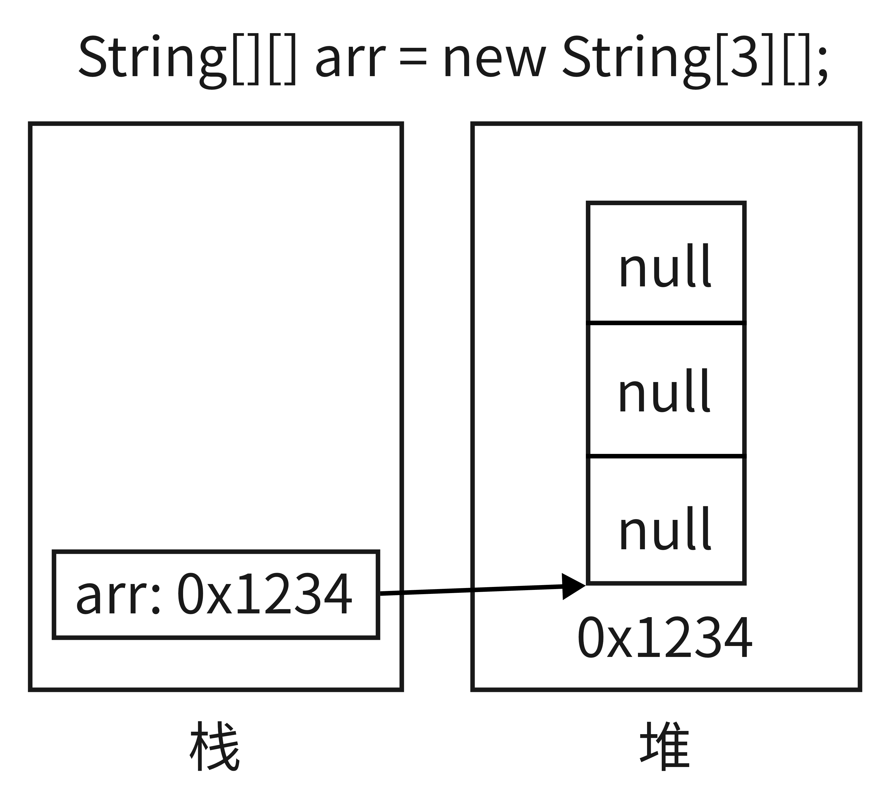
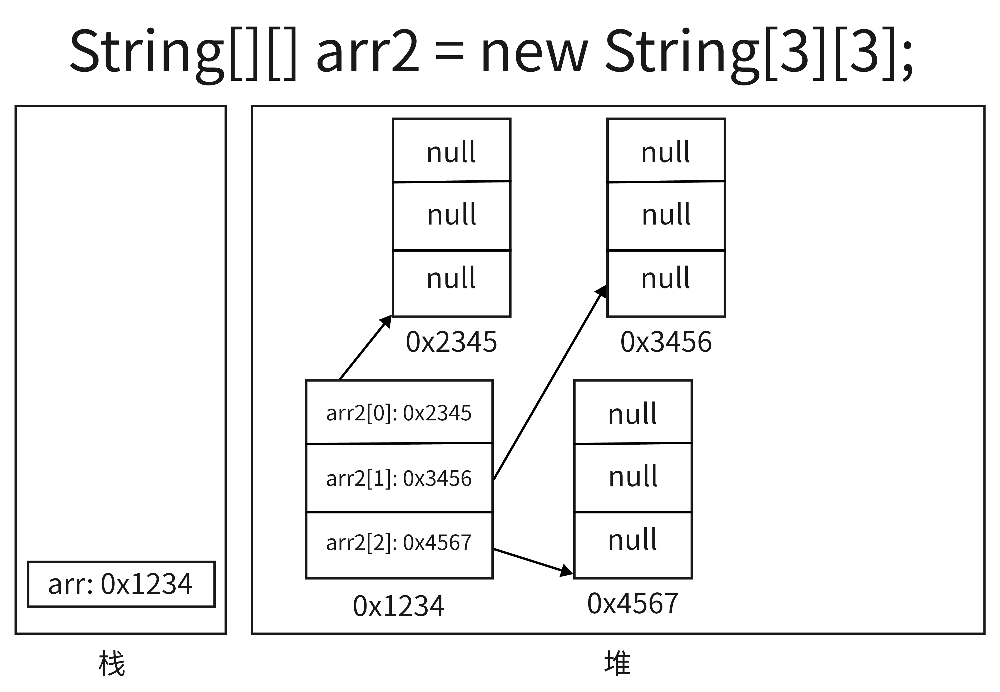
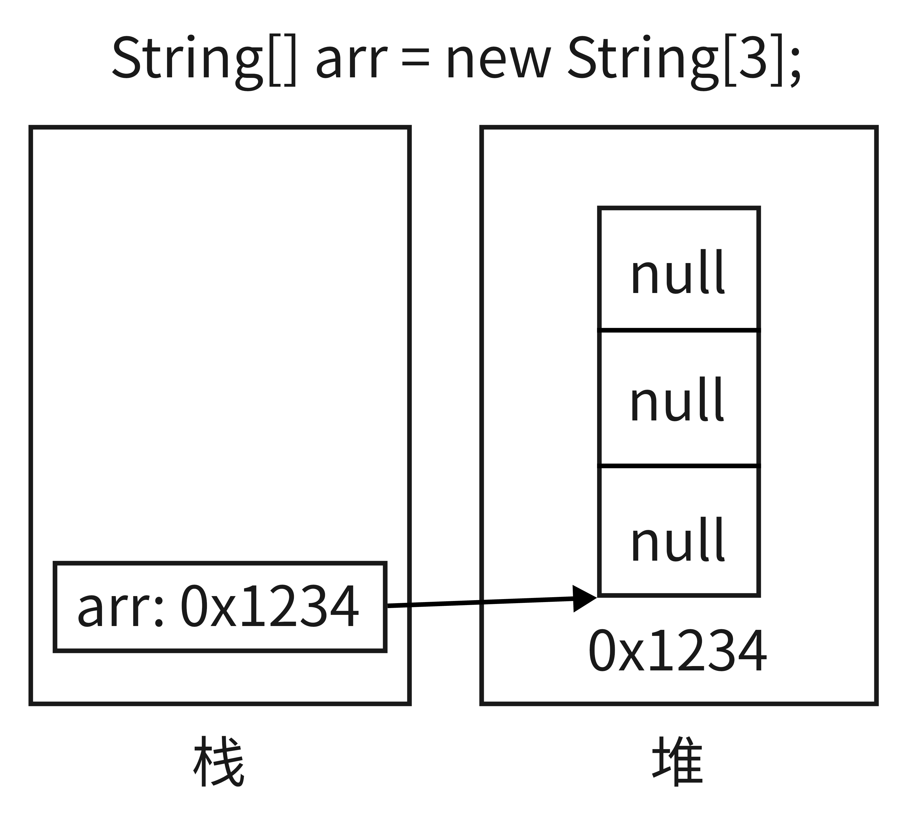
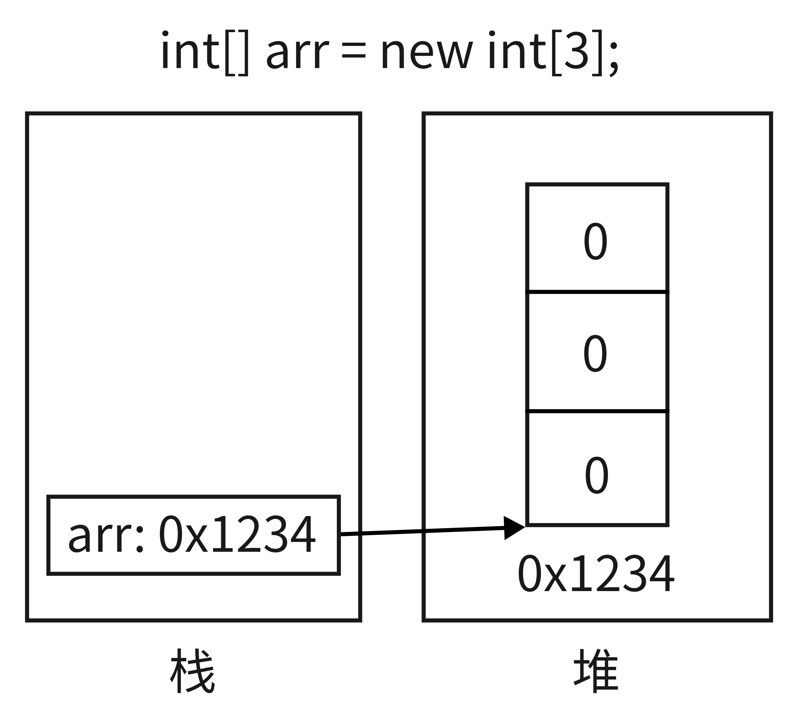
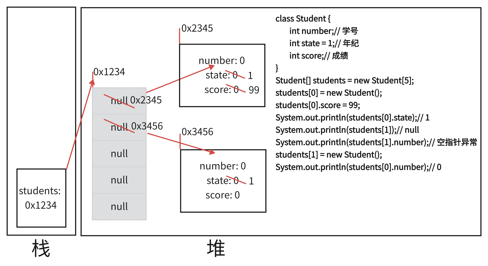

# Java基础之基础篇

## 重点之重点

```java
1.在Java中，整型常量默认是int型，浮点数常量默认是double型
2.String类型不在基本类型数据的自动类型转换链中，即“String str = 123;”这条语句会编译失败
3.String中的equals方法是被重写过的，因为Object的equals方法是比较的对象的内存地址，而String的equals方法比较的是对象的值
```

4. 在下面的Java语句中，int类型的128在计算机中存储为`00000000 00000000 00000000 10000000`，在强制转换为byte类型后在计算机存储为`10000000`，最前面的`1`变成了符号位，而`-127`的在计算机存储的格式为补码`10000001`，则此时`10000000`则是`-128`

```java
byte b = (byte) 128;
System.out.println(b);// -128
```

5. 运算符`++`/`--`会影响变量本身的值，这两个运算符的位置只是影响需要使用这个变量的时候是使用运算后或者运算前的值，但在使用过后运算符的位置在前在后，这时变量的值都是一样的，并且`++`/`--`不会影响变量的数据类型

6. 运算符`+=`、`-=`、`*=`、`/=`、`%=`会将计算后的结果强制转换成需要的数据类型

```java
short s = 12;
s %= 5;// 编译成功，相当于：s = s % 5 = 2
// s = s % 5;// 编译失败，5的数据类型默认是int型，不能用short类型接收结果

int i = 1;
i *= 0.1;// 编译成功
System.out.println(i);// 0
i++;
System.out.println(i);// 1

int n = 10;
n += (n++) + (++n);// n = n + (n++) + (++n) = 10 + 10 + 12 = 32
System.out.println(n);// 32
```

7. 取余运算符`%`的结果的正负与被除数的正负一致

```java
int n = 3;
System.out.println(n++);// 3
System.out.println(n);// 4
System.out.println(++n);// 5
double b = 3.1415;
double b1 = b % 3;
System.out.println(b1);// 0.14150000000000018
int n1 = -5;
int n2 = 5;
int n3 = n1 % 2;
int n4 = n1 % -2;
int n5 = n2 % 2;
int n6 = n2 % -2;
System.out.println(n3);// -1
System.out.println(n4);// -1
System.out.println(n5);// 1
System.out.println(n6);// 1
```

8. 三元运算符的效率比`if-else`更高

9. `Scanner`类中的`next()`和`nextLine()`的区别

   - `next()`

     > 1.以Enter为结束符并且一定要读取到有效字符(不包括`空格符`、`tab`、`Enter`等)并且`按下Enter`后才可以结束输入
     > 2.只要遇到`空格符`，`next() `方法会自动将`空格符`和`空格符之前的全部字符`去掉
     > 3.只有输入有效字符后才将其后面输入的空白作为分隔符或者结束符
     > 4.`next()`不能得到带有空格的字符串

   - `nextLine()`

     > 1.以`Enter`为结束符，只要读取到`Enter`就会结束输入
     > 2.`nextLine()`方法返回的是`输入回车之前的所有字符`
     > 3.可以获得`空格`	

10. **空指针异常出现的原因是调用了`null`身上的方法或者属性**

11. **我们目前学了很多种对于属性的赋值方法，其顺序是：**

    ```java
    1.默认初始化（属性在创建完成后，各种类型的属性会有其各自的默认值）
    2.显式初始化（在定义类的属性时，我们可以直接赋一个值）
    3.构造方法中初始化（在实例化类的对象时，我们可以在构造方法中传入参数对属性进行复制）
    4.通过“对象.属性“或“对象.方法”的方式赋值（创建完对象后，我们可以对对象的属性进行赋值）
    ```

## 一、编程入门

1. 冯·诺依曼结构计算机的五大基本构件包括运算器、存储器、输入设备、输出设备和控制器

   **这种结构的特点是：**程序以二进制代码的形式存放在存储器中；所有的指令都是由操作码和地址码组成；指令在其存储过程中按照执行的顺序进行存储；以运算器和控制器作为计算机结构的中心

**注意事项：**存储器包含内存（Random-Access Memory，RAM）和硬盘（Read-Olny Memory，ROM）

2. 中央处理器（Central Processing Unit，CPU）是计算机的大脑，它包括控制单元和逻辑/运算单元，运算单元完成数值运算，逻辑单元完成比较运算
3. 万维网是无数个网络站点和网页的集合，它们在一起构成了因特网Internet最主要的部分(因特网也包括电子邮件、Usenet以及新闻组)。它实际上是多媒体的集合，是由超级链接连接而成的。我们通常通过网络浏览器上网观看的,，就是万维网的内容

**注意事项：**`互联网`>`因特网`>`万维网`（三者是包含关系）

4. 计算机语言的发展历史：`机器语言`=>`汇编语言`=>`高级语言`（高级语言又分为面向过程和面向对象）

5. Java语言的特点：

   - 面向对象性：（1）两个要素：类、对象       (2）三个特征：封装、继承、多态

   - 健壮性：（1）去除了C语言中的指针     (2）添加了自动的内存垃圾回收机制

   - 跨平台性：`Write once, run anywhere`意为`一次编译，到处运行`（跨平台性是因为 JVM的功劳）


**注意事项：**有了自动垃圾回收机制仍然可能出现内存溢出的情况

> 内存溢出：程序运行时，内存不够用了
>
> 内存泄漏：内存被占用后且无法回收，当内存泄露多了，就会导致内存溢出的问题出现

## 二、Java入门

### 2.1 Java环境搭建

1. `JDK`：Java Development Kit，Java开发工具包
   `JDK`是提供给Java开发人员使用的，其中包含了Java的开发工具，也包括了`JRE`。所以安装了`JDK`，就不用在单独安装`JRE`了。其中的开发工具:编译工具（ javac.exe）和打包工具（ jar.exe）等

2. `JRE`：Java Runtime Environment Java运行环境
   `JRE`包括Java虚拟机（ JVM，Java Virtual Machine）和 Java 程序所需的核心类库等，如果想要运行一个开发好的Java程序，计算机中只需要安装`JRE`即可，JDK是程序开发者做程序开发时才需要安装
   
3. `JVM`: Java Virtual Machine，Java虚拟机

   `JVM`负责加载`已经编译完成`的`class`字节码文件以及运行`class`字节码文件

**注意事项：**运行`java`程序的最小环境为`JRE`，开发`java`程序的最小环境为`JDK`

```java
JDK = JRE + Java开发工具集
JRE = JVM + Java核心类库
```

### 2.2 注释

1. 单行注释和多行注释的作用：
   - 对所写的代码进行解释说明，增强可读性
   - 调试所写的代码


```java
public class HelloWorld {
	/* 多行注释:
	 * main方法是程序的入口
     * main方法的格式是固定的
	 */
	public static void main(String[] args) {
        // 单行注释: 下面这条语句是输入语句，可以在控制台输出
		System.out.println("Hello, World!");
	}
}
```

**注意事项：**单行注释和多行注释的内容不会参与编译

**注意事项：**多行注释不可以嵌套使用

2. 文档注释( Java特有)

```java
格式:/**
      @author 指定java程序的作者
      @version 指定源文件的版本
    */  
```

**注意事项：**文档注释内容可以被JDK提供的工具 javadoc 所解析，生成一套以网页文件形式体现的该程序的说明文档

### 2.3 总结

Java程序编写-编译-运行的过程

> **1.编写: 我们将编写的Java代码保存在以`.java`结尾的源文件中**

> **2.编译: 使用javac.exe命令编译我们的java源文件，格式:  `javac` `源文件名.java`**

> **3.运行: 使用java.exe命令解释运行我们的字节码文件， 格式: `java` `类名`**

**注意事项：**

> **1.`System.out.println()`是先输出再换行的**
>
> **2.在一个java源文件中可以声明多个class，但是只能最多有一个类声明为public的，且这个public类的名字必须和源文件名相同**
>
> **3.在使用`javac`命令编译java文件时，文件中有几个类就生成几个`.class`文件**

## 三、Java基本语法

### 3.1 关键字和保留字

#### 3.1.1 关键字

1. **用于定义数据类型的关键字**

   ```java
   class interface  enum  float  byte  short  int  long  double  char  boolean  void 
   ```

2. **用于定义流程控制的关键字**

   ```java
   if  else  switch  case  default  while  do  for  break  continue  return
   ```

3. **用于定义访问权限修饰符的关键字**

   ```java
   private  protected  public
   ```

4. **用于定义类、函数、变量修饰符的关键字**

   ```java
   abstract  final  static  synchronized
   ```

5. **用于定义类与类之间关系的关键字**

   ```java
   extends  implements
   ```

6. **用于定义建立实例以及引用实例、判断实例的关键字**

   ```java
   new  this  super  instanceof
   ```

7. **用于异常处理的关键字**

   ```java
   try  catch  finally  throw  throws
   ```

8. **用于包的关键字**

   ```java
   package  import
   ```

9. **其他修饰符关键字**

   ```java
   native  strictfp  transient  volatile  assert
   ```

10. **用于定义数据类型值的字面值**（**注意事项：**不是关键字，但可作为关键字对待）

   ```java
   true  false  null
   ```

#### 3.1.2 保留字

现有Java版本尚未使用，但以后版本可能会作为关键字使用，自己命名标识符时要避免使用这些保留字

> **goto     const**

### 3.2 标识符

1. **定义：**凡是能自己命名的地方都叫做标识符，例如：变量名、包名、类名、方法名、接口名.....
2. **命名规则：**如果不遵守下面的规则，则编译会失败

> 由26个英文字母的大小写、0-9、_或者$组成
>
> 数字不能开头
>
> 不可以使用关键字和保留字，但能包含关键字和保留字
>
> 严格区分大小写，长度不限制
>
> 不能包含空格

### 3.3 命名规范

> **包名：**多单词组成时所有字母都小写: xxxyyyzzz
>
> **类名、接口名：**多单词组成时，所有单词的首字母大写: XxxYyyZzz
>
> **变量名、方法名：**多单词组成时，第一个单词首字母小写，第二个单词开始每个单词首字母大写: xxxYyyZzz
>
> **常量名：**所有字母都大写，多单词时每个单词用下划线连接: XXX_YYYZZZ

### 3.4 变量

#### 3.4.1 变量定义与分类

1. **概念：**
  
   - 内存中的一个存储区域
   - 该区域的数据可以在同一类型范围内不断变化
- 变量是程序中最基本的存储单元，包含变量类型、变量名和存储的值
  
2. **声明和赋值变量：** <数据类型> <变量名> = <初始化值>

3. **变量类型：**

   **1）按照数据类型分：**

   - 基本数据类型：

     - 整型：byte(1字节)   int(4字节)  short(2字节)   long(8字节)
     - 浮点型：float(4字节)   double(8字节)
     - 布尔型：boolean(1字节)
     - 字符型：char(2字节)
  - 注意事项：当boolean类型的数组在编译的时候是作为byte array来编译的，所以boolean数组里面的每一个元素占一个字节，`boolean[] b = new boolean[10];` `// 作为boolean数组时，每一个boolean在JVM中占1个字节`
   
- 引用数据类型：
  
  类（class）      接口（interface）      数组（array）
  
   **2）按变量位置分：**
  
   - 成员变量
   - 局部变量

**注意事项：**

> 1. **Java中每个局部变量必须先声明并且赋值后，才能使用**
>2. **变量的作用域：其定义所在的一对{}内**
> 3. **变量只有在其作用域内才有效**
>4. **同一个作用域内，不能定义重名的变量**

#### 3.4.2 整型

byte（1字节 === 8bit）/short（2字节）/int（4字节）/long（8字节）

|          | byte     | short                          | int                                      | long           |
| -------- | -------- | ------------------------------ | ---------------------------------------- | -------------- |
| 表示范围 | -128~127 | -2^15^~2^15^-1（-32768~32767） | -2^31^~2^31^-1（-2147483648~2147483647） | -2^63^~2^63^-1 |

**注意事项：**java的整型常量默认为 int 型，声明long型常量须后加`l`或`L`，除非表示非常大的数时才使用long

**注意事项：**bit是计算机中的最小存储单位；byte是计算机中基本存储单元

#### 3.4.3 浮点型

float（4字节）/double（8字节）

**float：**单精度，尾数可以精确到小数点后7位有效数字，很多情况下精度很难满足需求

**double：**双精度，精度是float的两倍，通常采用此类型

浮点型常量有两种表示形式：

- 十进制数形式，如：5.12       512.0f       .512 (必须有小数点）

- 科学计数法形式，如：5.12e2        512E2        100E-2 

**注意事项：**Java 的浮点型常量默认为double型，声明float型常量时后面需要加`f`或`F`

#### 3.4.4 字符型

char（1字符 === 2字节）

**注意事项：**

> - 定义char型变量，只能使用一对单引号`''`包裹，单引号内不能为空，必须要有一个`字符`且只能有一个`字符`
>
> - 定义char型变量时，也可在单引号内写转义字符或者Unicode值来表示一个`字符`
>
> - 在定义char型变量时可以直接将一个整数(0~65535)赋值给char型变量，这个整数会被编译成Unicode中相应的字符
>
>   ```java
>   char c = 'a';
>   char c1 = 97;
>   System.out.println(c1);// a
>   System.out.println(c == c1);// true
>   ```
>
> - Unicode值格式为`\uXXXX`，`XXXX`表示一个十六进制数

```
常见的转义字符：\b退格符   \n换行符   \r回车符   \t制表符   \"双引号   \'单引号   \\反斜线
```

#### 3.4.5 布尔型

**boolean（4字节）:**布尔类型用来判断逻辑条件，一般用于程序流程控制

**注意事项：**boolean类型数据只允许取值true和false，不可以使用0或非0的整数替代false以及true

#### 3.4.6 基本数据类型转换

**注意事项：**这里讨论只是7种基本数据类型变量间的运算，不包含boolean类型

```
数值型变量表示范围：byte、short、char < int < long < float < double
```

1. **自动类型提升**：当表示范围小的数据类型与表示范围大的数据类型做运算时，用来接收结果的变量的表示范围必须大于等于做运算的变量的数据类型表示范围中的最大值，例如下面的示例：

```java
int number = 1;
float f = 3.0F;
float result = number + f; // 编译正确
// long result = number + f; // 编译失败
```

**结论**：在上面的代码块中，用来接收结果的result的数据类型的表示范围至少大于等于float的表示范围，否则会编译错误

**注意事项：**

> 1. 当byte、char、short这三种数据类型之间做运算时，因为会把这三种数据类型转换成int类型，所以结果要用int类型接收，这三种数据类型的同种类型之间做运算时也是如此
> 2. 整型直接量可以直接赋值给byte、short和char，但是不能超出表示范围，否则会溢出

2. **强制类型转换**：自动提升类型运算的逆运算
   - 需要时强制转换符：()
   - 转换时可能导致精度损失，比如浮点型转换成整型时，小数点后的数字会被舍去
   - 转换时可能会超出范围，导致溢出

```java
// 正常强制转换: 无溢出和精度丢失
long l = 156156L;
int i1 = (int) l;
System.out.println(i1);// 156156

// 精度损失举例
float f = 156.999F;
int i2 = (int) f;
System.out.println(i2);// 156

// 溢出举例
int num = 128;
byte b = (byte) num;
System.out.println(b);// -128
int num1 = 129;
byte b1 = (byte) num1;
System.out.println(b1);// -127
int num2 = 130;
byte b2 = (byte) num2;
System.out.println(b2);// -126
```

3. **两种特殊情况**

```java
// 编码情况1:
long 1 = 123213; // 这里的整数123123为常量，默认数据类型为int，所以可以向精度更高的数据类型long转换
System.out.println(1);
//long 11 = 21332423235234123; //编译失败：过大的整数(这里的常量大于了int所能表示的范围了)
long 11 = 21332423235234123L;
// float f1 = 12.3; // 编译失败：这里的浮点数12.3为常量，默认数据类型为double，所以不能向精度更低的数据类型float转换
float f1 = (float)12.3;

// 编码情况2:
// 整型常量，默认类型为int
// 浮点型常量，默认类型为double
byte b = 12;
// byte b1 = b + 1; // 编译失败
// float f1 = b + 12.3; // 编译失败
```

#### 3.4.7 String数据类型

##### 3.4.7.1 字符串的定义

1. `String`类是`java.lang`包下的一个类，由`final`修饰，不能被继承
2. `String`字符串的底层是一个字符数组`char[]`，所以`String`的底层也是Unicode编码格式
3. `String`是引用数据类型中的类（class），翻译为：`字符串`
4. 声明`String`数据类型时，必须要使用一对双引号`""`
5. `String`数据类型可以和8种基本数据类型做运算，但是只能做连接运算：`+`
6. `String`数据类型和8种数据类型做连接运算后的结果是字符串


```java
// String数据类型的定义
String string = "abcdefg";// 编译成功
// 下面这种方法一共创建了两个字符串对象：一个是通过双引号""字面量创建的，另一个是new出来的
String string2 = new String("abcdefg");// 编译成功

// String数据类型做运算
int num = 1001;
String str = "学号：";
String str1 = str + num;
System.out.println(str1); // 学号：1001
```

**注意事项：**`String`和`包装类`都重写了`equals()`方法，用以我们比较属性值是否相同

**注意事项：String不能直接转换成基本数据类型，但可以使用包装类的强转**

```java
// String str = 123; // 编译失败
String str = "123";
// int num = str; // 编译失败
// int num1 = (int) str; // 编译失败
```

**练习1：**

```java
char c = 'a';
int num = 10;
String str = "hello";
System.out.println(c + num + str);// 107hello
System.out.println(c + str + num);// ahello10
System.out.println(str + num + c);// hello10a
System.out.println(c + (num + str));// a10hello
System.out.println((c + num) + str);// 107hello
```

**练习2：**输出两个`*`，之间用制表符隔开

```java
System.out.println("*	*");             // *	*
System.out.println('*' + '\t' + '*');    // 93
System.out.println('*' + "\t" + '*');    // *   *
System.out.println('*' + '\t' + "*");    // 51*
System.out.println('*' + ('\t' + "*"));  // *	*
```

##### 3.4.7.2 String普通方法

>
> - **String类的静态方法String valueOf()：**将其他数据类型转换成字符串
>
> ```java
> double b = 3.1415926;
> String str = String.valueOf(b);// 推荐使用
> String str1 = b + "";// 不推荐使用，效率低
> ```
>
>
> - **char charAt(int index)：**可以获得指定位置的字符并返回该位置处的字符
> - **注意事项：**参数过大或者过小都会发生**`字符串索引越界异常StringIndexOutOfBoundsException`**
>
> ```java
> String str = "thinking in Java";
> System.out.println(str.charAt(0));// 't'
> System.out.println(str.charAt(8));// ' '
> System.out.println(str.charAt(12));// 'J'
> ```
>
> - **boolean equals(String src)：**比较两个字符串的内容是否相等并转化为Boolean值作为返回值
> - **boolean equalsIgnoreCase(String src)：**比较两个字符串的内容在忽略英文字母大小写的情况下是否相等并将其转化为Boolean值作为返回值
>
> ```java
> String s8 = "hello";
> String s9 = new String(s8);
> String s10 = new String("hello");
> // ==比较的是字符串对象的地址
> System.out.println(s8 == s9);//false
> System.out.println(s8 == s10);//false
> // equals()方法比较的是字符串内容
> System.out.println(s8.equals(s9));// true
> System.out.println(s8.equals(s10));// true
> ```
>
> - **int indexOf(String src, int index)：**返回当前字符串从指定位置开始指定字符串第一次出现的位置，没找到的话返回-1
>
> ```java
> String str = "thinking in Java";
> System.out.println(str.indexOf("in"));// in
> System.out.println(str.indexOf("in", 2));// 2
> System.out.println(str.indexOf("in", 3));// 5
> System.out.println(str.indexOf("in", 6));// 9
> ```
>
> - **int lastIndexOf(String src, int index)：**返回从索引0到index之间指定字符串最后一次出现的位置，没有的话返回-1
>
> ```java
> String str = "thinking in Java";
> System.out.println(str.lastIndexOf("in"));// 9
> System.out.println(str.lastIndexOf("in", 0));// -1
> System.out.println(str.lastIndexOf("in", 1));// -1
> System.out.println(str.lastIndexOf("in", 2));// 2
> System.out.println(str.lastIndexOf("in", 3));// 2
> System.out.println(str.lastIndexOf("in", 5));// 5
> System.out.println(str.lastIndexOf("in", 15));// 9
> ```
>
> - **int length()：**获取字符串的字符个数并将其作为返回值返回
>
> ```java
> String s = "好好学习，天天向上！";
> String s1 = "好好学习，\t天天向上！";
> String s2 = "好好学习 天天向上！";
> System.out.println(s.length());// 10
> System.out.println(s1.length());// 11
> System.out.println(s2.length());// 10
> System.out.println("xxxxx\txx".length());// 8
> ```
>
> - **boolean startsWith(String src, int toffset)：**判断当前字符串从指定位置开始是否以指定字符串开头
>
> ```java
> String str = "thinking in Java";
> System.out.println(str.startsWith("hi", 0));// false
> System.out.println(str.startsWith("hi", 1));// true
> System.out.println(str.startsWith("hi", 2));// false
> ```
>
> - **String substring(int start, int end)：**截取指定起始位置和结束位置之间的字符串返回
> - **注意事项：**截取的字符串包含起始位置，不包含结束位置
>
> ```java
> String url = "www.baidu.cn";
> System.out.println(url.substring(url.indexOf(".") + 1, url.lastIndexOf(".")));// baidu
> ```
>
> - **boolean endsWith(String src)：**判断当前字符串是否以指定字符串结尾
>
> ```java
> System.out.println(str.endsWith("ava"));// true
> System.out.println(str.endsWith(" Java"));// true
> System.out.println(str.endsWith("av"));// false
> ```
>
> - **String toLowerCase()：**将字符串中的所有英文部分转换为全小写并将其作为返回值返回
>
> ```java
> String str = "我爱Java！";
> String lower = str.toLowerCase();
> System.out.println(lower);// 我爱java！
> ```
>
> - **String toUpperCase()：**将字符串中的所有英文部分转换为全大写并将其作为返回值返回
>
> ```java
> String str = "我爱Java！";
> String upper = str.toUpperCase();
> System.out.println(upper);// 我爱JAVA！
> ```
>
> - **String trim()：**去除字符串首尾的空格符后将新的字符串作为返回值返回
>
> ```java
> String s = " 好好学习，天天向上！\t";
> System.out.println(s); // 好好学习，天天向上！\t
> s = s.trim();
> System.out.println(s);
> ```
>

##### 3.4.7.3 String正则方法

> - **boolean matches(String regexp)：**检查当前字符串是否符合指定正则表达式并返回布尔值
>
> ```java
> // [a-zA-Z0-8_]+@[a-zA-Z0-9]+(\.com|\.cn)+
> String regExp = "[a-zA-Z0-9_]+@[a-zA-Z0-9]+(\\.com|\\.cn)+";
> String email1 = "hrd18960706057@163.com";
> String email2 = "hrd1896$0706057@163.com";
> String email3 = "hrd18960706057@163.com.cn";
> String email4 = "hrd_18_960706057@163.cn.com.cn.com";
> boolean match1 = email1.matches(regExp);
> boolean match2 = email2.matches(regExp);
> boolean match3 = email3.matches(regExp);
> boolean match4 = email4.matches(regExp);
> System.out.println(match1);// true
> System.out.println(match2);// false
> System.out.println(match3);// true
> System.out.println(match4);// true
> ```
>
> - **String replaceAll(String regexp, String src)：**将当前字符串中所有符合正则表达式的所有字符替换成指定字符
>
> ```java
> String line = "sfc5gf1541s5df4s54g1wd5fs4";
> line = line.replaceAll("[0-9]+", "数字");
> System.out.println(line);// sfc数字gf数字s数字df数字s数字g数字wd数字fs数字
> String line2 = "sfc5gf1541s5df4s54g1wd5fs4";
> line2 = line2.replaceAll("[0-9]", "_");
> System.out.println(line2);// sfc_gf____s_df_s__g_wd_fs_
> ```
>
> - **String[] split(String regexp)：**将当前字符串以指定的正则表达式作为分隔符，将当前字符串划分成一个或者多个字符串，并将所有字符串以字符串数组形式返回
> - **注意事项：**最开始的字符部分和中间字符部分符合给定的正则表达式时，拆出来的`""`也会被算进返回的字符串数组中，但是当最后的字符部分符合给定的正则表达式时，拆出来的`""`则不会被算进返回的字符串数组中
>
> ```java
> String line = "sfc5gf1541s5df4s54g1wd5fs4";
> String[] lineArray = line.split("[0-9]+");
> System.out.println(Arrays.toString(lineArray));// [sfc, gf, s, df, s, g, wd, fs]
> String[] lineArray2 = line.split("[0-9]");
> System.out.println(Arrays.toString(lineArray2));// [sfc, gf, , , , s, df, s, , g, wd, fs]
> String line2 = ".213...243.43...";
> String[] lineArray3 = line2.split("\\.");
> System.out.println(Arrays.toString(lineArray3));// [, 213, , , 243, 43]
> ```

##### 3.4.7.4 字符串常量池

**字符串常量池是`Java`对`String`的一个优化措施，`Java`推荐我们使用`字面量/直接量`(直接使用`""`)的方式来创建字符串对象，并且会将所有`以字面量方式创建的对象缓存到`常量池`中，当使用相同字面量再创建字符串对象时将会复用常量池中的对 象，以减少内存开销**

#### 3.4.8 StringBuilder类型

##### 3.4.8.1 创建对象

```java
StringBuilder s1 = new StringBuilder();// 表示空字符串
StringBuilder s2 = new StringBuilder("abc");// abc
// String类型 ==> StringBuilder类型
String s3 = "123";
StringBuilder s4 = new StringBuilder(s3);// 123
// StringBuilder类型 ==> String类型
String s5 = s4.toString();// 123
```

##### 3.4.8.2 常用方法

**注意事项：StringBuilder下面4个常用方法都会修改字符串本身**

> - **void append(String src)：**在字符串末尾后添加指定字符串
>
> ```java
> StringBuilder stringBuilder = new StringBuilder("好好学习Java");
> System.out.println(stringBuilder);// 好好学习Java
> stringBuilder.append("，为了找到好工作");
> System.out.println(stringBuilder);// 好好学习Java，为了找到好工作
> ```
>
> - **void replace(int start, int end, String src)：**将指定起始位置和结束位置替换成目标字符串
> - **注意事项：**目标字符串为空时，相当于delete()方法；被替换的字符串包含**`起始位置`**但不包含**`结束位置`**
>
> ```java
> StringBuilder stringBuilder = new StringBuilder("好好学习Java，为了找到好工作");
> stringBuilder.replace(8, 17, "，为了改变世界");
> System.out.println(stringBuilder);// 好好学习Java，为了改变世界
> stringBuilder.replace(0, 2, "");
> System.out.println(stringBuilder);// 学习Java，为了改变世界
> ```
>
> - **void delete(int start, int end)：**删除指定起始位置和结束位置的字符串
> - **注意事项：**被删除的字符串包含**`起始位置`**但不包含**`结束位置`**
>
> ```java
> StringBuilder stringBuilder = new StringBuilder("学习Java，为了改变世界");
> stringBuilder.delete(0, 7);
> System.out.println(stringBuilder);// 为了改变世界
> ```
>
> - **void insert(int start, String src)：**从指定位置插入指定字符串
>
> ```java
> StringBuilder stringBuilder = new StringBuilder("为了改变世界");
> stringBuilder.insert(0, "活着就是");
> System.out.println(stringBuilder);// 活着就是为了改变世界
> ```

#### 3.4.9 常见的进制

>二进制(binary): 0、1，满2进1，以0b或0B开头
>十进制(decimal): 0-9，满10进1
>八进制(octal): 0-7，满8进1，以数字0开头
>十六进制(hex): 0-9及A-F，满16进1，以0x或0X开头表示，此处的A-F不区分大小写，如：0x21AF +1 = 0X21B0

**计算机以二进制补码的形式保存所有的整数**

1. 正数的原码、反码、补码都相同
2. 负数的补码是其反码+1

**二进制的整数有如下三种形式：**

1. 原码：直接将一个数值换成二进制数，最高位是符号位
2. 负数的反码：是对原码按位取反，符号位不变
3. 负数的补码：其反码加1

### 3.5 运算符

- 算术运算符：`+`，`-`，`*`，`/`，`%`，`++`，`--`
- 关系运算符：`>`、`<`、`>=`、`<=`、`==`、`!=`
- 逻辑运算符：`&&`、`||`、`&`、`|`、`!`
- 赋值运算符：`=`、`+=`、`-=`、`*=`、`/=`、`%=`
- 连接运算符：`+`
- 位运算符：`&`、`|`、`~`、`^`、`<<`、`>>`、`>>>`

### 3.6 流程控制

流程控制语句是用来控制程序中各语句执行顺序的语句，可以把语句组合成能完成一定功能的小逻辑模块，Java有三种基本流程控制结构，分别是`顺序结构`、`分支结构`和`循环结构`

#### 3.6.1 顺序结构

定义：程序从上到下逐行地执行，中间没有任何判断和跳转

#### 3.6.2 分支结构

1. 根据条件，选择性地执行某段代码

2. 有`if-else`和`switch-case`两种分支语句

   （1）`if-else`

   > 1.条件表达式必须是布尔表达式（关系表达式或逻辑表达式）、布尔变量
   >
   > 2.语句块只有一条执行语句时，一对`{}`可以省略，但建议保留
   >
   > 3.`if-else`语句结构，根据需要可以嵌套使用
   >
   > 4.当`if-else`结构是“多选一”时，最后的else是可选的，根据需要可以省略
   >
   > 5.当多个条件是“互斥”关系时，条件判断语句及执行语句间顺序无所谓，当多个条件是“包含”关系时，“小上大下 / 子上父下”

   （2）`switch-case`

   > 1.根据表达式中的值，依次匹配各个`case`中的常量，一旦匹配成功，则进入相应`case`结构中，调用其执行语句，当调用完执行语句以后，则仍然继续向下执行其他`case`结构中的执行语句，直到遇到`break`关键字或此`switch-case`结构末尾结束为止

   > 2.`break`：在`switch-case`结构中，表示一旦执行到此关键字，就跳出`switch-case`结构

   > 3.`case`子句中的值必须是常量，不能是变量名或不确定的表达式值

   > 4.同一个`switch`语句，所有`case`子句中的常量值互不相同

   > 5.`default`子句是可任选的，位置也是灵活的，当没有匹配的case时，执行default

   > 6.`switch`后的表达式，只能是如下数据类型：
   >  `byte `、`short`、`char`、`int`、`枚举类型`（JDK1.5新增）、`String`（JDK1.7新增）

**注意事项：**`switch-case`的运行效率比`if-else`高

#### 3.6.3 循环结构

1. 根据循环条件，重复性的执行某段代码	

2. 有`while`、`do…while`、`for`三种循环语句

   **循环结构有四个要素：初始化条件、循环条件、循环体和迭代条件**

   （1）`for循环`

   > 1.循环条件只能为boolean类型表达式，当值为false时，退出循环
   >
   > 2.初始化条件部分可以声明多个变量，但必须是同一个类型，用逗号分隔
   >
   > 3.迭代条件可以有多个变量更新，用逗号分隔
   >
   > 4.在`JDK1.5`版本时添加了`增强for循环`，内部是通过`Iterator`实现的，所以不能`动态的增删元素`
   >
   > ```java
   > for(元素类型 变量名 : 集合或数组){
   > 	循环体
   > }
   > String[] data = {"one", "two", "three", "four", "five"};
   > for (String str : data) {
   >     System.out.print(str + " ");
   > }
   > // one two three four five 
   > System.out.println();
   > 
   > Collection collection = new ArrayList();
   > collection.add("one");
   > collection.add("two");
   > collection.add("three");
   > collection.add("four");
   > collection.add("five");
   > for (Object obj : collection) {
   >     String str = (String) obj;
   >     System.out.print(str + " ");
   > }
   > // one two three four five 
   > ```

   （2）`while循环`

   > 1.注意不要忘记声明迭代条件，否则循环将不能结束，变成死循环
   >
   > 2.`for`循环和`while`循环可以相互转换
   >
   > 3.`for`循环和`while`循环的初始化条件部分的作用范围不同

   （3）`do...while`

   > 1.`do-while`循环至少会执行一次循环体
   >
   > 2.当循环体能执行两次及以上时，`while`和`do...while`执行的次数相同

3. **跳出循环的关键字：**

   > - `break`：跳出循环，break只能跳出当前一层循环
   >
   > - `continue`：跳过循环体中剩余语句而进入下一次循环
   > - 可以通过给循环命名，将循环名写在`break`或者`continue`的后面用以`结束指定层次的循环`或者`结束指定层次的当前这次循环`
   >
   > ```java
   > out: for (;;) {
   >     for (;;) {
   >         // continue;// 结束当前循环的当次循环
   >         // break;// 只能跳出当前循环
   >         // continue out;// 可以结束外层循环的当次循环
   >         break out;// 可以跳出外层循环
   >     }
   > }
   > ```

**注意事项：**`JDK1.5`提供了`for-each`循环，方便的遍历集合、数组元素

```java
int[] data = new int[] {0, 1, 2, 3, 4, 5, 6, 7, 8, 9};
for (int i : data) {
    System.out.print(i + " ");
}
// 0 1 2 3 4 5 6 7 8 9 
```

#### 3.6.4 跳出循环

跳出循环有两个关键字：`break`和`continue`，这两个关键字结束的循环位置遵循`就近原则`

- **break：**结束当前循环

- **continue：**结束当前这次循环，开始下一次循环

**注意事项：**当有循环嵌套时，我们可以给循环命名，以便与使用`break`、`continue`结束指定的循环，比如想要在内层循环可以结束外层循环，另外同级别的循环命名可以相同

```java
first:
for (int i = 1; i < 5; i++) {
    System.out.print(i + "：");
    for (int j = 1; j < 5; j++) {
        if (j == 4) {
            break first;
        }
        System.out.print(j + " ");
    }
    System.out.println();
}
// 上面的循环在控制台打印出：
// 1：1 2 3 
first:
for (int i = 1; i < 5; i++) {
    System.out.print(i + "：");
    for (int j = 1; j < 5; j++) {
        if (j == 4) {
            continue first;
        }
        System.out.print(j + " ");
    }
    System.out.println();
}
// 上面的循环在控制台打印出：
// 1：1 2 3 2：1 2 3 3：1 2 3 4：1 2 3 
```

### 3.7 正则表达式

**注意事项：**`.`不做特殊字符使用时，需要使用转义字符`\.`来表示`.`

1. `[]`表示一个字符，该字符可以是`[]`中的任意字符

   - `[abc]`表示`a`、`b`、`c`中的任意一个字符
   - `[a-z]`表示`a`—`z`中的任意一个字符
   - `[A-Z]`表示`A`—`Z`中的任意一个字符
   - `[a-zA-Z]`表示`英文字母`中的任意一个字符
   - `[a-zA-Z0-9]`表示`英文字母`和`数字`中的任意一个字符
   - `[^abc]`表示只要不是`a`、`b`、`c`三个中的任意一个其他字符

2. `()`用于分组，是将`小括号`里面的内容看做是一个整体

   - `(abc){3}`表示abc`整体出现3次`可以匹配`abcabcab`，但是不能匹配`aaa`或`abc`或abcabccba
   - `(abc|def){3}`表示`abc`或`def`整体`出现3次`可以匹配`abcabcabc`或`abcdefabc`，但是不能匹配`abcdef` 或`abcdfbdef`

3. 预定义字符，正则表达式中事先定义好的字符

   > - `.`表示任意一个字符，没有范围限制
   > - `\d`表示任意一个数字等同于[0-9]
   > - `\w`表示任意一个单词字符，等同于[a-zA-Z0-9]，单词字符指`字母`、`数字`和`_`
   > - `\s`表示任意一个空白字符
   > - `\D`不是数字
   > - `\W`不是单词字符
   > - `\S`不是空白字符

4. 量词

   > - `?`表示前面的内容`出现0-1次`，例如`[abc]?`可以匹配`a`或`b`或`c`或什么也不写，但是不能匹配`m`或`aaa`
   > - `+`表示前面的内容`最少出现1次`，例如:`[abc]+`可以匹配`b`或`aaaaaaaaaa`或`abcabcbabcbabcba`，但是不能匹配什么都不写
   > - `*`表示前面的内容出现`任意次[0, 多次]`，配内容与`+`一致，相比之下只是比`+`多了可以一次都不写这种写法
   > - `{n}`表示前面的内容`出现n次`，例如`[abc]{3}`可以匹配`aaa`或`bbb`或`aab`或`abc`或`bbc`，但是不能匹配`aaaa`或`aad`
   > - `{n,m}`表示前面的内容出现`最少n次`并且`最多m次`，例如`[abc]{3,5}`可以匹配`aaa`或`abcab`，但是不能匹配`aaaaaa`
   > - `{n,}`表示前面的内容`出现n次以上(含n次)`，例如`[abc]{3,}`可以匹配`aaa`或`aaaaa`

## 四、数组

### 4.1 数组的定义

数组(Array)是多个相同类型数据按一定顺序排列的集合，并使用一个名字命名，并通过编号的方式对这些数据进行统一管理

### 4.2 数组的常见概念

- 数组名
- 下标或者索引
- 元素：数组中存储的数据
- 数组长度：数组中元素的个数

### 4.3 数组的特征

1. **数组本身是引用数据类型**，而数组中的元素可以是任何数据类型，包括基本数据类型和引用数据类型

2. 创建数组对象会在内存中开辟一整块连续的空间，而数组名中引用的是这块`连续空间的首地址`

3. 数组的长度一旦确定，就不能修改

4. 我们可以直接通过下标(或索引)的方式调用指定位置的元素，速度很快

5. 数组的分类：

   > **按照维度：一维数组、二维数组、三维数组、…**
   >
   > **按照元素的数据类型分：基本数据类型元素的数组、引用数据类型元素的数组(即对象数组)**

### 4.4 数组元素默认值

| 数据类型               |            默认值             |
| :--------------------- | :---------------------------: |
| byte、short、int、long |               0               |
| float、double          |              0.0              |
| char                   | 0或写为：'\u0000'（表现为空） |
| boolean                |             false             |
| 引用类型（包含String） |             null              |

### 4.5 数组的使用

#### 4.5.1 一维数组

1. 一维数组的声明和初始化：静态初始化和动态初始化

   ```java
   //静态初始化：数组的元素在声明时就添加进数组中
   int[] array = new int[] {1, 2, 3, 4, 5};
   // 错误写法：
   // int[] array = new int[6] {1, 2, 3, 4, 5};
   
   //动态初始化：先创建指定长度的数组，元素后面再添加
   int[] array2 = new int[5];
   ```

2. 如何调用数组的指定位置的元素

   - 数组元素的引用方式：**数组名[元素索引]**
   - 数组的索引值从`0`开始计算，最大值是数组的`长度-1`

3. 如何获取数组的长度：每个数组都有一个属性`length`指明它的长度

4. 如何遍历数组

   ```java
   int[] array = new int[] {1, 2, 3, 4, 5};
   for(int i = 0; i < array.length; i++) {
   	System.out.print(" " + array[i]);
   }
   // 在控制台输出为：
    1 2 3 4 5
   
   // 利用加强for循环遍历数组
   for(int i item: array) {
   	System.out.print(" " + item);
   }
   // 在控制台输出为：
    1 2 3 4 5
   ```

#### 4.5.2 二维数组

二维数组的声明和初始化：静态初始化和动态初始化

```java
// 静态初始化
int[][] array1 = new int[][] {{1, 2, 3}, {4, 5}, {6, 7, 8}};
int[][] array2 = {{1, 2, 3}, {4, 5}, {6, 7, 8}};
int[] array3[] = {{1, 2, 3}, {4, 5}, {6, 7, 8}};
// 动态初始化
// 每个一维数组都是默认初始化值null
int[][] arr2 = new int[3][2];
int[][] arr3 = new int[3][];
int arr4[][] = new int[3][];
int[] arr5[] = new int[3][];
```

**注意事项：对于二维数组的理解，我们可以看成是一维数组array1又作为另一个一维数组array2的元素而存 在，其实，从数组底层的运行机制来看，其实没有多维数组**

### 4.6 数组的内存分析

#### 4.6.1 二维数组

```java
String[][] arr = new String[3][];
```



```java
String[][] arr2 = new String[3][3];
```



#### 4.6.2 一维数组

```java
String[] arr2 = new String[3];
```



```java
int[] arr2 = new int[3];
```



### 4.7 数组元素的查找

#### 4.7.1 线性查找

> 从数组的第一个按照索引顺序依次对比数组元素，适用于任何类型的数组

```java
String[] array = new String[] {"AA", "CC", "VV", "XX", "FF", "SS"};
String target = "GG";
boolean flag = true;
for(int i = 0; i < array.length; i++) {
    if(array[i] == target) {
        flag = false;
        System.out.print("找到了，其索引值是" + i);
    }
}
if (flag) {
    System.out.print("很遗憾，没有找到！");
}
```

#### 4.7.2 二分法查找

> **只适用于数组元素按照一定顺序排列的数组**

```java
int[] array = new int[] {-36, -6, -1, 0, 5, 9, 18, 63, 100, 108};
int target = 63;
boolean flag = true;
int start = 0;
int end = array.length - 1;
while(end >= start) {
    int middle = (end + start) / 2;
    if(array[middle] == target) {
        flag = false;
        System.out.print("找到了，其索引值是" + middle);
        break;
    } else if (array[middle] > target) {
        end = middle;
    } else {
        start = middle;
    }
}
if (flag) {
    System.out.print("很遗憾，没有找到！");
}
```

### 4.8 数组的排序

数组中常见的排序方法：

- 选择排序：直接选择排序、堆排序
- 交换排序：冒泡排序、快速排序
- 插入排序：直接插入排序、折半插入排序、Shell排序
- 归并排序
- 桶式排序
- 基数排序

**注意事项：冒泡排序和快速排序需要能够手写，归并排序和堆排序需要了解其实现思想，其他排序方法随意**

#### 4.8.1 选择排序

```java
// 从小到大排序：时间复杂度为O(n * n)
int[] arr = {31, 45, 61, 95, 46, 82, 61, 21, 16, 25, 57};
int temp;
for (int i = 0; i < arr.length - 1; i++) {
    for (int j = i + 1; j < arr.length; j++) {
        if (arr[i] > arr[j]) {
            temp = arr[i];
            arr[i] = arr[j];
            arr[j] = temp;
        }
    }
}
for (int item : arr) {
    System.out.print(item + " ");
}
```

#### 4.8.2 冒泡排序

```java
// 从小到大排序：时间复杂度为O(n * n)
int[] arr = {31, 45, 61, 95, 46, 82, 61, 21, 16, 25, 57};
for (int i = 0; i < arr.length - 1; i++) {
    for (int j = 0; j < arr.length -1 - i; j++) {
        if (arr[j] > arr[j + 1]) {
            int temp = arr[j];
            arr[j] = arr[j + 1];
            arr[j + 1] = temp;
        }
    }
}
for (int item : arr) {
    System.out.print(item + " ");
}
```

#### 4.8.3 快速排序

```java
// 交换数组两个索引值处的元素 
public static void exchangeItem(int[] arr, int i, int j) {
    int temp = arr[i];
    arr[i] = arr[j];
    arr[j] = temp;
}

public static void sortItem(int[] arr, int start, int end) {
    // 确保传入的参数顺序正确，并且保证递归后的数组部分的元素数大于1
    if (start < end) {
        // 确定基数
        int baseNum = arr[start];
        // 定义高指针、低指针
        int low = start;
        int high = end + 1;
        while (true) {
            // “low < end”确保递归调用时低指针不会比传递参数大，并从前往后找到大于基数的元素为止
            while (low < end && arr[++low] >= baseNum);
            // “high > start”确保递归调用时高指针不会比传递参数小，并从后往前找到小于基数的元素为止
            while (high > start && arr[--high] <= baseNum);
            // 如果此时低指针低于高指针，则交换两个指针处的元素，并继续执行上面过的操作
            // 直到将数组从索引值start到end的元素已经完全分为大于和小于基数的两部分
            if (high > low) {
                exchangeItem(arr, low, high);
            } else {
                // 如果低指针大于等于高指针，说明此时已经将数组从索引值start到end的元素已经分为大于和小于基数的两部分了
                break;
            }
        }
        // 将基数与高指针处的元素交换
        exchangeItem(arr, start, high);
        //递归调用
        sortItem(arr, start, high - 1);
        sortItem(arr, high + 1, end);
    }
}

public static void main(String[] args) {
    int[] arr = {59, 64, 32, 12, 81, 32, 41, 66, 89, 49, 72, 50};
    System.out.println("排序之前：\n" + java.util.Arrays.toString(arr));
    sortItem(arr, 0, arr.length - 1);
    System.out.println("排序之后：\n" + java.util.Arrays.toString(arr));
}
/* 排序之前：
 * [59, 64, 32, 12, 81, 32, 41, 66, 89, 49, 72, 50]
 * 排序之后：
 * [12, 32, 32, 41, 49, 50, 59, 64, 66, 72, 81, 89] 
 */
```

#### 4.8.4 插入排序

**思想：**以数组第一个元素为基数，从第二个元素开始，依次对比左侧的元素，如果右侧的元素比左侧的元素小，就交换两个数的位置

```java
int[] data = {-23, 50, 12, -2, -55, 63, -67, 52, 62, -19, 84, 73, -71, 30, -45, 0, 99};
System.out.println("排序前是：" + Arrays.toString(data));
for (int i = 1; i < data.length; i++) {
    int tempIndex = i;
    for (int j = i - 1; j >= 0; j--) {
        if (data[j] > data[tempIndex]) {
            int temp = data[tempIndex];
            data[tempIndex] = data[j];
            data[j] = temp;
            tempIndex = j;
        } else {
            break;
        }
    }
}
System.out.println("排序前后：" + Arrays.toString(data));
// 排序前是：[-23, 50, 12, -2, -55, 63, -67, 52, 62, -19, 84, 73, -71, 30, -45, 0, 99]
// 排序后是：[-71, -67, -55, -45, -23, -19, -2, 0, 12, 30, 50, 52, 62, 63, 73, 84, 99]
```

### 4.9 数组工具类

`java.util.Arrays`类即为操作数组的工具类，包含了用来操作数组（比如排序和搜索）的各种方法，常用的有以下几种：

- `boolean equals(int[] a,int[] b)`：判断两个数组是否相等
- `String toString(int[] a)`：输出数组信息
- `void fill(int[] a,int val)`：将指定值填充到数组之中
- `void sort(int[] a)`：对数组进行排序，底层用的快速排序
- `int binarySearch(int[] a, inr key)`：对排序后的数组进行二分法检索指定的值，返回值是负数的话则是没有找到

### 4.10 数组异常总结 

数组中常见的异常有数组索引越界异常和空指针异常

- 数组索引越界异常：ArrayIndexOutOfBoundsException

  ```java
  int[] arr = new int[] {1, 2, 3, 4, 5};
  // System.out.println(arr[-1]);// 报数组索引越界异常
  System.out.println(arr[5]);// 报数组索引越界异常
  ```

- 空指针异常：NullPointerException

  **空指针异常出现的原因是调用了`null`身上的方法或者属性**

  ```java
  // 1.情况一：
  //int[] arr = new int[] {1, 2, 3, 4, 5};
  int[] arr = new int[];
  arr = null;
  System.out.println(arr[0]);// 报空指针异常
  
  // 2.情况二：
  int[][] arr = new int[4][];
  System.out.println(arr[2]);// null
  System.out.println(arr[2][]);// 报空指针异常
  
  // 3.情况三
  String[] arr = new String[] {"AA", "BB", "CC", "DD"};
  arr[0] = null;
  System.out.println(arr[0]);// null
  System.out.println(arr[0].toString());// 报空指针异常
  ```

### 4.11 数组的复制

1. `System.arraycopy(被复制的数组, 从被复制数组开始复制的位置, 接收数据的数组, 接受数据数组的接收起始下标, 接受几个元素);`
   `System.arraycopy(Object src, int scrPosition, Object destination, int destinationPosition, int length);`

   **注意事项：**不管是被复制数组的元素不够还是接收数组的长度不够，都会报数组索引越界异常(ArrayIndexOutOfBoundsException)

2. `int[] arr2 = Array.copyOf(被复制的数组, 目标数组的长度);`

   `Arrays.copyOf(Object src, int length)`该方法会返回一个新的数组

   **注意事项：**

   - 被复制数组的长度 > 目标数组的长度，截取掉末尾的元素

    * 被复制数组的长度 < 目标数组的长度，不够的部分用默认值补位

### 4.12 数组转换集合

将数组转换为集合，需要使用`Arrays`工具类的`asList(Object[] src)`方法，该方法返回对应数组类型的`List`集合

**注意事项：**

- 因为数组与`List`集合的存储结构类似，所以才能转换成功
- 因为转换后的`List集合`存储的是`数组`中存储的元素`地址值`，所以对`数组`以及转换后的`List集合`中的其中任何一个进行任何操作时，都相当于对另外一个进行相同的操作，又因为数组的长度固定，所以不能对`集合`进行`增加和删除`操作，因为这会将操作同步到数组身上，否则会报不支持操作异常`UnsupportOperationException`

```java
String[] data = {"one", "two", "three", "four", "five"};
System.out.println(Arrays.toString(data));// [one, two, three, four, five]

// asList()方法返回的List集合中的元素存储的是对象引用地址
List<String> list = Arrays.asList(data);
System.out.println(list);// [one, two, three, four, five]

// 对数组中的元素修改之后，集合中的数据也会被修改
data[0] = "six";// [six, two, three, four, five]
System.out.println(Arrays.toString(data));
System.out.println(list);// [six, two, three, four, five]

// 对集合中的元素修改之后，数组中的数据也会被修改
list.set(3, "seven");
System.out.println(Arrays.toString(data));// [six, two, three, seven, five]
System.out.println(list);// [six, two, three, seven, five]

// 给集合添加或删除元素相当于给数组添加或删除元素
// 而数组的长度固定，不会自动扩容、缩容的，因此发生不支持操作异常
// list.add("!!!");// 编译失败，报不支持操作异常(UnsupportedOperationException)
```

## 五、面向对象

1. **Java类以及类的成员：**`属性`、`方法`、`构造方法`、`代码块`和`内部类`（前三个为重点）
2. **面向对象的三大特征：**`封装性`、`继承性`和`多态性`（另外有些地方会加上一个`抽象性`）
3. **其他关键字：**`this`、`supe`r、`static`、`final`、`abstract`、`interface`、`package`、`import`等

### 5.1 面向对象的概念

1. **面向过程：**强调的是功能行为，以函数为最小单位，考虑怎么做
2. **面向对象：**强调具备了功能的对象，以类/对象为最小单位，考虑谁来做
3. **面向对象的两个要素：**
   - 类：对一类事物的描述，是抽象的、概念上的定义
   - 对象：是实际存在的该类事物的具体个体，因而也称为实例(instance)

>  **注意事项：面向对象程序设计的重点是类的设计，设计类主要就是设计类的成员**

### 5.2 类和对象的创建

```java
// 测试类
public class PersonTest {
    public static void main(String[] args) {
        // 2.创建类的实例
        Person person = new Person();
        // 3.调用对象的属性和方法
        person.name = "胡歌";
        person.age = 19;
        person.isMale = true;
        System.out.println(person.name);
        System.out.println(person.age);
        System.out.println(person.isMale);
        person.eat();
        person.talk("Chinese");
    }
}

// 1.设计创建类，设计类的成员变量(属性)和成员方法(方法)
class Person {
    // 属性
    String name;
    int age = 18;// 默认值
    boolean isMale;
    
    // 方法
    public void eat() {
        System.out.println("吃饭");
    }
    public void talk(String language) {
        System.out.println("可以说" + language);
    }
}
```

**匿名对象：**创建的对象没有显式的赋予一个变量名，这种对象我们叫做匿名对象，匿名对象只能使用一次

```java
class Student {
    int number;// 学号
    int state = 1;// 年纪	
    int score;// 成绩
}
new Student().number = 10;
System.out.println(new Student().number);// 1
```

### 5.3 类的属性

**成员变量(属性)和局部变量之间的相同点、不同点**

- **相同点**

> 1. 定义的格式相同
> 2. 都是先声明赋值，再使用
> 3. 变量都有其对应的作用域

- **不同点**

> 1. **在类中声明的位置的不同**
>
> - 属性：直接定义在类的一对`{}`内
> - 局部变量：声明在方法内的变量、方法的形参、代码块内的变量、构造方法的形参、构造方法内部的变量
>
> 2. **关于权限修饰符的不同**
>
> - 属性：可以在定义时，使用权限修饰符指明其权限，权限修饰符有`public`、`private`、`protected`和`default(缺省)`
>
> - 局部变量：不可以使用权限修饰符
>
> 3. **默认初始化值的不同**
>
> - 属性：根据其数据类型的不同都有不同的初始值
>   - 整型（byte、short、int、long）：0
>   - 浮点型（float、double）：0.0
>   - 字符型（char）：'\u0000'
>   - 布尔型（boolean）：false
>   - 引用数据类型（字符串、数组、类、接口）：null
> - 局部变量：使用之前必须要显性赋值，否则编译不成功（形参是例外，只需要在使用时赋值即可）
>
> 4. **在内存中的位置不同**
>
> - 属性：非static属性加载到堆空间里，static的属性加载到方法区里
> - 局部变量：加载到栈空间里

### 5.4 类的方法

`方法`也称`函数`、`过程`，用于封装一段特定的业务逻辑代码，使得可以反复调用，这样可以减少代码重复，以利于后期的代码维护，只要是一段独立的业务逻辑代码，我们就应该将其封装起来

#### 5.4.1 方法的声明

```java
// 方法的定义格式
// 权限修饰符 修饰符 返回值类型 方法名(参数列表) {
//    方法体;
// }

public void call() {};
public void talk(String[] arr) {};
public int speak() {
    return 1;
};
public String sleep(int age) {
	return "我" + age + "岁了，长得很帅!";
};
```

**注意事项：**

1. 可以用修饰符`public`、`private`、`protected`、`static`、`final`、`abstract`来修饰的方法

2. **方法名+参数列表=方法的签名**

#### 5.4.2 方法的返回值

> - 如果方法有返回值，则必须在方法声明时指定返回值的类型，在方法中需要使用`return`关键字来返回指定类型的变量或常量：`return 数据;`
> - 如果方法没有返回值，则方法声明时，使用void来表示
> - 没有返回值的方法中一般就不需要使用return，如果使用的话，只能使用`return;`表示结束此方法的意思

#### 5.4.3 return关键字

> - **使用范围：**只能使用在方法体中
> - **作用：**①结束方法   ②针对于有返回值类型的方法，使用`return 数据;`返回所要的数据
> - **注意点：**return关键字后面不可以声明执行语句

**注意事项：**

> - **在调用方法的过程中，可以调用当前类的其他属性或方法**
> - **方法内部不可以再定义其他方法**
> - **特殊的：方法A中又调用了方法A，我们将这种方法称为递归方法**

#### 5.4.4 方法的重载

1. **重载的概念：**在同一个类中，允许存在一个以上的同名方法，只要它们的参数个数或者参数类型不同即可
2. **重载的特征：**重载与返回值类型无关，只看参数列表，并且参数列表必须不同(`参数个数`、`参数类型`和`参数顺序`)，调用时不同的同名方法时，根据方法参数列表的不同来区别不同的方法
3. **多个方法构成重载的要素：**
   - 在同一个类当中
   - 方法名必须相同
   - 参数列表不同：`参数个数`不同、`参数类型`不同或者`参数顺序`不同，只要符合其中一个都算是重载

```java
/* 下面是方法的重载的示例 */
//返回两个整数的和
int add(int x, int y) {
    return x + y;
}
//返回三个整数的和
int add(int x, int y, int z) {
    return x + y + z;
}
//返回两个小数的和
double add(double x, double y) {
    return x + y;
}
```

#### 5.4.5 可变形参

> - 声明格式：方法名(参数的类型名 ... 参数名)
> - 可变参数：方法参数部分指定类型的参数个数是可变多个：0个、1个或者多个
> - 可变个数形参的方法与同名的方法之间，彼此构成重载
> - 可变参数方法的使用与方法参数部分使用数组是一致的
> - 方法的参数部分有可变形参，需要放在其他形参的后面，即可变形参需要放在形参声明的最后
> - 在一个方法的形参位置，最多只能声明一个可变个数形参
> - 当其他方法的形参列表和有可变形参列表的方法同时符合调用方法时传递的参数列表，可变形参方法的优先级在后
>
> ```java
> public class VariableArgs {
>     public static void main(String[] args) {
>         VariableArgs variableArgs = new VariableArgs();
>         variableArgs.show(1);// 1
>         variableArgs.show(1, "Hello", " World!");// 1   Hello World!
>         variableArgs.show();// show(String ... strings)
>     }
>     
>     public void show(int num) {
>         System.out.println(num);
>     }
>     
>     public void show(int num, String ... strings) {
>         System.out.print(num);
>         System.out.print("   " + strings[0]);
>         System.out.println(strings[1]);
>     }
>     
>     public void show(String ... strings) {
>         System.out.println("show(String ... strings)");
>     }
> }
> ```

**特别的：下面的两个方法会被认为是同一个方法**

```java
public void show(String[] strings) {
    System.out.println("show(String[] strings)");
}
public void show(String ... strs) {
    System.out.println("show(String ... strings)");
}
```

#### 5.4.6 值传递机制(重点)

Java里方法的参数传递方式只有一种：值传递，即将实际参数值的副本 (复制品)传入方法内，而参数本身不受影响

- 形参是基本数据类型：将实参基本数据类型变量的`数据值`传递给形参
- 形参是引用数据类型：将实参引用数据类型变量的`地址值`传递给形参

### 5.5 对象数组内存解析

```java
class Student {
    int number;// 学号
    int state = 1;// 年纪
    int score;// 成绩
}
Student[] students = new Student[5];
students[0] = new Student();
students[0].score = 99;
System.out.println(students[0].state);// 1
System.out.println(students[1]);// null
System.out.println(students[1].number);// 空指针异常
students[1] = new Student();
System.out.println(students[0].number);// 0
```



### 5.6 三大特性

#### 5.6.1封装性

我们程序设计追求`高内聚，低耦合`，隐藏对象内部的复杂性，只对外公开简单的接口，便于外界调用

- 高内聚：类的内部数据操作细节自己完成，不允许外部干涉
- 低耦合：仅对外暴露少量的方法用于使用

Java中通过将属性`xxx`声明为私有的`private`，再提供公共的`public`方法：`getXxx()`和`setXxx()`实现对该属性的操作

> - 隐藏一个类中不需要对外提供的实现细节
>- 使用者只能通过事先定制好的方法来访问数据，可以方便地加入控制逻辑， 限制对属性的不合理操作
> - 便于修改，增强代码的可维护性

#### 5.6.2 继承性

1. **继承的定义：**多个类中存在相同属性和行为时，将这些内容抽取到单独一个类中， 那么多个类无需再定义这些属性和行为，只要继承单独的这个类即可，此处的多个类称为`派生类`或者`派生类`，单独的这个类称为`超类`、`基类`或者`超类`

```java
// 类的继承语法规则
class Subclass extends SuperClass {
    ......
}
```

2. **继承的作用：**

> - 继承的出现减少了代码冗余，提高了代码的复用性
> - 继承的出现，更有利于功能的扩展
> - 继承的出现让类与类之间产生了关系，为多态性提供了的前提

**注意事项：**不要仅为了获取其他类中某个功能而去继承，超类和派生类之间一定要有某种联系

3. **继承的特点：**

> - 派生类继承了超类，就相当于继承了超类的方法和属性
> - 在派生类中，可以使用超类中定义的方法和属性，也可以创建新的数据和方法
> - 在Java 中，继承的关键字用的是`extends`，即派生类不是超类的子集， 而是对超类的`扩展`
> - 派生类不能直接访问超类中私有的`private`的成员变量和方法

4. **继承的规则：**Java只支持`单一继承`和`多层继承`，不允许多重继承

- 构造派生类之前必须先构造超类
- 一个派生类有且仅能有一个超类
- 一个超类可以被多个派生类继承，与此同时，这个超类也可以有且仅有一个自己的超类

#### 5.6.3 多态性

**`多态性`**是面向对象中最重要的概念，因为一个类如果没有超类的话，系统就会让这个类默认继承Object类，所以Java中所有的类都直接或者间接的继承了Object类，这就是为了多态，实现了**`万物皆对象`**的理念

1. **定义：**对象的多态性：超类的引用指向派生类的对象
   - 可以直接应用在抽象类和接口上

2. **特点：**`Java`中引用变量有两个类型：`编译时类型`和`运行时类型`，编译时类型由声明该变量时使用的类型决定，运行时类型由实际赋给该变量的对象决定，简称：**编译时，看左边；运行时，看右边**
   - 若编译时类型和运行时类型不一致，就出现了对象的`多态性`
     - **==编译时，看左边==** ：看的是超类的引用，超类中不具备派生类特有的方法
     - **==运行时，看右边==** ：看的是派生类的对象，实际运行的是派生类重写超类的方法

3. **注意事项：**
   - 一个引用类型变量如果声明为超类的类型，但实际引用的是派生类对象，那么该变量就不能再访问派生类中添加的属性和方法
   - 派生类可看做是特殊的超类，所以超类类型的引用可以指向派生类的对象

#### 5.6.4 权限修饰符

四种权限修饰符可以修饰的结构：类和类的成员（**`属性`、`方法`、`构造方法`、`内部类`**）

|       权限修饰符        | 类的内部 | 同一个包 | 不同包的派生类 | 同一个工程 |
| :---------------------: | :------: | :------: | :------------: | :--------: |
|   **private：私有的**   |    ✅     |    ❌     |       ❌        |     ❌      |
|   **(缺省)：默认的**    |    ✅     |    ✅     |       ❌        |     ❌      |
| **protected：受保护的** |    ✅     |    ✅     |       ✅        |     ❌      |
|   **public：公开的**    |    ✅     |    ✅     |       ✅        |     ✅      |

**注意事项：对于class的权限修饰只可以用public和default(缺省)**

> **public类:** 可以在任意地方被访问
>
> **default类:** 只可以被同一个包的其他类访问

### 5.7 构造方法

1. **构造方法的作用：**①配合关键字**`new`**创建对象        ②给对象进行初始化

2. **构造方法的特征：**

> 1. 它具有与类相同的名称
> 2. 它不声明返回值类型，与声明为void不同
> 3. 不能被`static`、`final`、`synchronized`、`abstract`、`native`修饰
> 4. 不能有`return`语句返回值

3. **构造方法的分类：**

> 1. 隐式无参构造方法（系统默认提供）
> 2. 显式定义一个或多个构造方法（无参、有参）

**注意事项：**

- Java语言中，每个类都至少有一个构造方法，自定义构造方法和默认提供的构造方法均可
- 默认构造方法的修饰符与所属类的修饰符一致
- 一旦显式定义了构造方法，则系统不再提供默认构造方法
- 一个类可以定义多个重载的构造方法
- 超类的构造方法不可被派生类继承

### 5.8 关键字

#### 5.8.1 package

`package`语句作为`Java`源文件的第一条语句，指明该文件中定义的类所在的包(若缺省该语句，则指定为无名包)，它的格式为： `package 顶层包名.子包名;`，例如下面的例子：

```java
// pack1\pack2\PackageTest.java
package pack1.pack2; //指定类PackageTest属于包pack1.pack2

public class PackageTest {
	public static void main(String[] args) {
		System.out.println("Hello World!");
	}
}
```

**注意事项：**同一个包中不能有重复的类名，不同包的类可以重名

#### 5.8.2 import

`import`用于导入类，一般写在声明包的语句下面和类的声明之间

- 同包中的类可以直接访问，但不同包中的类不能直接访问，若想访问有以下两种方式

  - 1. 类的全称，因太繁锁，所以不建议

    ```java
    // 例如想在day01包里的Aoo类创建day02.first包里的Boo类的对象
    public class Aoo {
    	public static void main(String[] args) {
            day02.first.Boo car = new day02.first.Boo();
        }
    }
    ```

  - 2.先import导入类，再访问类，此为建议模式

    ```java
    // 例如想在day01包里的Aoo类创建day02.first包里的Boo类的对象
    import day02.first.Boo;
    public class Aoo {
    	public static void main(String[] args) {
            Boo car = new Boo();
        }
    }
    ```

**注意事项：**想要导入其他包里的类在当前包里有同名类时，只能使用第一种方式

#### 5.8.2 this

1. 在`Java`中，`this`关键字比较难理解，它的作用和其词义很接近

   - 它在方法内部使用，即这个方法所属对象

   - 它在构造方法内部使用，表示该构造方法正在初始化的对象

2. this可以调用类的属性、方法和构造方法，当在方法内需要用到调用该方法的对象时，就用`this`，我们可以用`this`来区分属性和局部变量，比如：`this.name = name`

3. 使用this访问对象的属性和方法时， 如果在本类中未找到，会从超类中查找

**注意事项：**

> 可以用`this(形参列表)`的方式，调用本类中重载的其他的构造方法
>
> 明确：构造方法中不能通过`this(形参列表)`的方式调用自身构造方法
>
> 如果一个类中声明了`n`个构造方法，则最多有`n-1`个构造方法中使用了 `this(形参列表)`
>
> `this(形参列表)`必须声明在类的构造方法的首行
>
> 在类的一个构造方法中，最多只能声明一个`this(形参列表)`，即在构造方法中只能引用一个其他的构造方法

#### 5.8.3 super

1. **super的作用：**在Java类中使用`super`来调用超类中的属性或者方法

   > - `super`可用于在派生类方法中访问超类中定义的属性
   >
   > - `super`可用于在派生类方法中调用超类中定义的成员方法
   > - `super`可用于在派生类构造方法中调用超类的构造方法

2. **注意事项：**

   > - 尤其当子超类出现同名成员时，可以用`super`表明调用的是超类中的成员
   > - `super`的追溯不仅限于直接超类，可以追溯到超类的超类甚至更上面
   > - `super`和`this`的用法相像，`this`代表本类对象的引用，`super`代表超类的内存空间的标识

3. **重点：**

   - **如果超类中有无参构造方法（默认或者自写的都可以），则派生类中所有的构造方法默认都会访问超类中的无参构造方法**
   
   - **当超类中没有无参构造方法时，派生类的构造方法必须通过`this(参数列表)`或者`super(参数列表)`语句指定调用本类或者超类中相应的构造方法，并且只能”二选一” ，且必须放在构造方法的首行**
   - **如果派生类构造方法中既未显式调用超类或本类的构造方法，且超类中又没有无参构造方法，则会编译出错**
   

**注意事项：this与super的对比**

|  NO   |    区别点    |                            this                            |                         super                          |
| :---: | :----------: | :--------------------------------------------------------: | :----------------------------------------------------: |
| **1** |   访问属性   | 首先访问本类中的属性，如果本类没有此属性则从超类中继续查找 |                  直接访问超类中的属性                  |
| **2** |   调用方法   | 首先访问本类中的方法，如果本类没有此方法则从超类中继续查找 |                  直接访问超类中的方法                  |
| **3** | 调用构造方法 |          调用本类构造方法，必须放在构造方法的首行          | 直接调用超类构造方法，并且必须放在派生类构造方法的首行 |

#### 5.8.4 static

1. `static`关键字的引入

> 当我们编写一个类时，其实就是在描述其对象的属性和行为，而并没有产生实质上 的对象，只有通过new关键字才会产生出对象，这时系统才会分配内存空间给对象， 其方法才可以供外部调用。我们有时候希望无论是否产生了对象或无论产生了多少 对象的情况下，某些特定的数据在内存空间里只有一份，例如所有的中国人都有个 国家名称，每一个中国人都共享这个国家名称，不必在每一个中国人的实例对象中都单独分配一个用于代表国家名称的变量

**总结：如果想让一个类的所有实例共享某一个数据或者方法，就将其定义为类的属性或者类的方法**

2. 使用范围： 类的`属性`、`方法`、`代码块`、`内部类`
3. 被修饰后的成员具备以下特点： 
   - 随着类的加载而加载
   - 优先于对象加载存在
   - 用`static`修饰的成员，被该类的所有对象所共享
   - 访问权限允许时，可不创建对象，直接被类调用

**注意事项：**

> 1. 加载或者执行顺序：①静态变量=>②静态方法=>③静态代码块=>④实例变量=>⑤实例方法=>⑥普通代码块=>⑦构造方法
> 2. 没有对象的实例时，可以用`类名.方法名()`的形式访问由`static`修饰的静态方法
> 3. 在`static`方法内部只能访问类的`stati`c修饰的属性或方法，不能访问类的非`static`的结构
> 4. 当一个方法的执行与类的对象无关，即方法体中不需要使用到实例方法和实例变量时，就可以将其定义成静态方法

```java
// 静态块类
public class StaticBlock {
    StaticBlock() {// 构造方法
        System.out.println("构造方法执行中...");
    }
    
    static {// 静态代码块先于其他成员加载执行
        System.out.println("静态代码块代码执行中...");
    }
}
// 静态变量类
public class StaticVar {
    int a;
    static int b;
    
    public StaticVar() {
        a++;
        b++;
    }
    
    void show() {
        System.out.println("a = " + a + ", b = " + b);
    }
}
// 静态成员测试类
public class StaticDemo {
    public static void main(String[] args) {
        StaticVar staticVar = new StaticVar();
        staticVar.show();
        StaticVar staticVar1 = new StaticVar();
        staticVar1.show();
        StaticVar staticVar2 = new StaticVar();
        staticVar2.show();
        // a = 1, b = 1
        // a = 1, b = 2
        // a = 1, b = 3
        
        /* 静态代码块只执行一次，且优先于其他非静态成员加载 */
        StaticBlock staticBlock = new StaticBlock();
        StaticBlock staticBlock1 = new StaticBlock();
        StaticBlock staticBlock2 = new StaticBlock();
        // 静态代码块代码执行中...
        // 构造方法执行中...
        // 构造方法执行中...
        // 构造方法执行中...
    }
}
// 静态方法类
public class StaticMethod {
    int a;
    static int b;
    // 1.静态方法中不能使用实例变量和实例方法
    void show() {
        // 有系统提供默认的this指向当前对象
        System.out.println(a);
        System.out.println(b);
    }
    static void test() {
        // 因为静态方法是属于类的，一般调用时都是通过类来调用，不会传递对象到方法体中，导致this没有当前对象可以指向
        // 所以系统在静态方法中就没有默认提供this，又因为静态方法中没有this，所以静态方法中不能使用非静态变量和实例方法
        // System.out.println(a);
        // show();
        System.out.println(b);
    }
    
    // 2.因为方法的执行中不需要使用实例方法和实例变量
    // 所以将plus方法设计成静态方法，使得调用时不用创建对象，更快捷
    static int plus(int num1, int num2) {
        return num1 + num2;
    }
}
```

#### 5.8.5 final

在`Java`中声明类、变量和方法时，可使用关键字`final`来修饰,表示`最终的`、`不可更改的`

- `final`修饰的类不能被继承，目的是为了提高安全性，提高程序的可读性
  - **例如：**`String类`、`System类`、`StringBuffer类`等

- `final`修饰的方法不能被派生类重写
  - **例如：**`Object`类中的`getClass()`

- `final`修饰的变量不能被修改，这时变量变成了常量
  - `final`修饰的成员变量必须在声明时或在每个构造方法中或代码块中**`显式赋值`**，然后才能使用
  - **例如：**`final double MY_PI = 3.14`

**注意事项：我们将被`static final`修饰的变量称为常量。常量声明的同时必须赋值，一般通过类名访问**

**注意事项：常量效率高的原因是常量在编译时就被替换成具体的值**

```java
public class StaticFinalDemo {
    public static void main(String[] args) {
        /* 静态变量 */
        // 1.加载Loo.class到方法区中
        // 2.将PI一并加载到方法区中
        // 3.去方法区中取到PI的值然后输出
        System.out.println(Loo.PI);// 一般通过类名访问
        // Loo.PI = 3.1514927;// 常量的值不能修改
    
        /* 静态常量 */
        // 常量效率高的原因：常量在编译时就被替换成具体的值，下面的两条语句编译后一样
        System.out.println(Loo.NUM);
        System.out.println(379);
    }
}

/* 演示常量 */
class Loo {
    public static final double PI = 3.1415906;
    public static final int NUM = 379;
    // public static final int NUM;// 常量声明的同时必须赋值
}
```

#### 5.8.6 abstract

关键字`abstract`用来修饰类或者方法，表示`抽象的`、`不完整的`

- 用`abstract`关键字来修饰一个类，这个类叫做抽象类

- 用`abstract`来修饰一个方法，该方法叫做抽象方法
  - 抽象方法：只有方法的声明，没有方法体，以分号作为行结束
  - **例如：**`public abstract void talk();`

- **注意事项：**只要有一个方法是抽象类，则该方法必须声明为抽象类，抽象类中不一定有抽象方法

#### 5.8.7 instanceof

对Java对象的类型转换称为造型，又分为向上造型和向下造型(强制类型转换)

- 从派生类到超类的类型转换可以自动进行
- 从超类到派生类的类型转换必须通过向下造型(强制类型转换)实现
- 无继承关系的引用类型间的转换是非法的
- 在造型前可以使用instanceof操作符测试一个对象的类型，只有以下两种情况可以强制类型转换
  - 引用所指向的对象的类，就是该类型
  - 引用所指向的对象的类，实现了该接口或继承了该类

#### 5.8.8 main方法

> 1. 由于Java虚拟机需要调用类的main()方法，所以该方法的访问权限必须是public，又因为Java虚拟机在执行main()方法时不必创建对象，所以该方法必须是static的，该方法接收一个String类型的数组参数，该数组中保存执行Java命令时传递给所运行的类的参数
>
> 2. 又因为main() 方法是静态的，我们不能直接访问该类中的非静态成员，必须创建该类的一个实例对象后，才能通过这个对象去访问类中的非静态成员

### 5.9 方法的重写

1. **方法的定义：**在派生类中可以根据需要对从超类中继承来的方法进行改造，在程序执行时，派生类的方法将覆盖超类的方法

2. **调用方法或者属性时的时候，先在当前类里找，当前类没有再去超类中去找**

3. **注意事项：**

   > - 派生类与超类中同名同参数的方法必须同时声明为非static的(即为重写)，或者同时声明为 static的不是重写，因为static方法是属于类的，派生类无法覆盖超类的方法
   > - 在返回值为引用数据类型的方法当中，该方法的方法体中实际返回的返回值类型必须小于或等于方法名前写的返回值类型

   ```java
   public class Grandpa {}
   
   public class Father extends Grandpa {}
   
   public class Son extends Father {
       public Father eat() {
           // return new Grandpa();// 编译失败，Grandpa类的对象类型大于Father类的对象
           // return new Father();// 编译成功
           return new Son();// 编译成功
       }
   }
   ```

4. **重写的规则：不能继承的方法就不能重写**

   - 派生类重写的方法必须和超类被重写的方法具有相同的方法名称、参数列表，否则不构成重写

   - 派生类重写的方法使用的访问权限不能小于超类方法的访问权限

   - 派生类不能重写超类中声明为`private`权限的方法（派生类中可以写与超类签名相同的方法，但是`不会构成方法重写`）

   - 派生类方法抛出的异常不能大于超类被重写方法的异常

   - 派生类重写的方法的返回值类型必须小于或等于超类被重写的方法的返回值类型
     - 超类的方法返回值类型为`void`或者`基本数据`类型时，派生类的返回值必须和超类相同

     - 超类的方法返回值类型为`引用数据`类型时，派生类的返回值类型必须小于或等于超类

       ```java
       // 下面为正确的继承格式
       public class Grandpa {}
       
       public class Father extends Grandpa {
           public Grandpa say() {
               return new Son();
           }
       }
       // 当超类方法的返回值是Grandpa对象时，派生类的返回值可以是Grandpa、Father或Son
       // 当超类方法的返回值是Father对象时，派生类的返回值可以是Father或Son
       // 当超类方法的返回值是Son对象时，派生类的返回值则只能是Son
       public class Son extends Father {
           public Son say() {
               return new Grandpa();
           }
           // public Father say() {
           //     return new Father();
           // }
           // public Son say() {
           //     return new Son();
           // }
       }
       ```

### 5.10 抽象类和方法

1. 抽象类的引入

> 当所有派生类都有同一个方法(行为名一样)，但具体的行为动作不一样，例如地球上的每种生物都需要进食`eat()`，但是吃的东西都不一样，`eat()`这种方法需要在超类中声明为抽象方法，超类也应该声明为抽象类，这时超类只管声明，不管具体的实现

2. 含有抽象方法的类必须被声明为抽象类

- 抽象类不能被实例化，抽象类是用来被继承的
- 抽象类的派生类必须重写超类的抽象方法，并提供方法体，若没有重写全部的抽象方法，仍为抽象类
- 不能用`abstract`修饰`变量`、`代码块`、`构造方法`
- 不能用`abstract`修饰`私有方法`、`静态方法`、`final的方法`、`final的类`

3. 实际意义：在实际开发中，一个项目一定是团队协作的，以动物案例为例，假设在`Animal`中不设计`eat()`方法:

```java
张三写Dog类--------------eatSomething()
李四写Chick类------------eating()
王五写Fish类-------------haveSomething()
```

赵六想让动物们吃，他在调用吃方法的时候就傻眼了，他得知道每个类中的吃的具体的名字，调起来相当麻烦，因为不统一

这时，我们在`Animal`类中设计一个抽象方法`eat()`，强制派生类重写`eat()`方法

**总结：抽象类是用来模型化那些超类无法确定方法体的行为操作，而是强制其派生类重写方法并提供具体方法体的类**

### 5.11 接口

1. 接口**`Interface`**的引入

   > 一方面，有时必须从几个类中派生出一个派生类，继承它们所有的属性和方法。但是Java不支持多重继承，有了接口，就可以得到多重继承的效果。另一方面，有时必须从几个类中抽取出一些共同的行为特征，而它们之间又 没有is的关系，仅仅是具有相同的行为特征而已，例如：鼠标、键盘、打 印机、扫描仪、摄像头、充电器、MP3机、手机、数码相机、移动硬盘等都支持USB连接。继承是一个**`是不是`**的关系，而接口实现则是 **`能不能`** 的关系

2. 接口**`Interface`**的特点
   - 接口是抽象方法和常量值定义的集合
   - 用**`interface`**来定义
     - 例如：**`public interface Swim {}`**
   
   - 接口中的成员访问权限只能是**`public`**，不写的话所有成员都默认是由**`public`**修饰的
   
   - 接口中的所有成员变量都默认是由**`public static final`**修饰的
- 接口中的所有普通方法都默认是由**`public abstract`**修饰的
   - 接口中没有构造方法，可以有**`默认方法`**和**`静态方法`**，这两种方法都是**`jdk1.8`**新添加的
   
3. 接口是需要被实现或者继承的，实现类或者派生类：必须重写接口中的所有抽象方法
   - 一个实现类可以实现多个接口，接口名之间用逗号分隔
   - 接口也可以继承其它接口
   - 若派生类又继承又实现时，应先继承后实现
   - 重写接口中的方法时，必须加**`public`**(先记住)，因为接口中的方法默认都是**`public`**
   - 实现接口的类中必须提供接口中所有方法的具体实现内容，否则仍为抽象类

**注意事项：**

> - 面向接口编程：接口的主要用途就是被实现类实现
> - 与继承关系类似，接口与实现类之间存在多态性
> - 接口和类是并列关系，或者可以理解为一种完全抽象类，即接口里的所有方法都是抽象方法，而且没有变量和方法的实现

### 5.12 类和接口的联系

#### 5.12.1 设计规则

- 将所有派生类所共有的属性和行为，抽到超类中----------抽共性
  - 若派生类的行为/代码都一样，设计为普通方法
  - 若派生类的行为/代码不一样，设计为抽象方法，让派生类强制重写一个同名方法
- 将部分派生类共有的行为，抽到接口中
  - 接口是对继承单一性的扩展-------实现多继承(表述对象具备哪些功能、短小精悍)
  - 接口是一种标准、规范，若实现某接口意味着就具备某个功能，若不实现接口意味着就不具备那个功能-------后期才能理解得更好

#### 5.12.2 类间关系

- 类和类------------迷承extends
- 接口和接口------继承extends
- 类和接口---------实现implements

### 5.13 内部类

#### 5.13.1 成员内部类

1. 引入类中套类，外面的称为外部类，里面的称为内部类
2. 成员内部类的特点：
   - 内部类通常只服务于外部类，对外不具备可见性
   - 内部类对象通常在外部类中创建
   - 内部类中可以直接访问外部类的成员
     - **原因：**在内部类中有个隐式的引用指向创建它的外部类对象隐式的引用，例如：**`外部类名.this`**
3. 何时使用：若A类只让B类使用，并且A类还想访问B类的成员时，就可以将A类设计为B类的成员内部类
4. **成员内部类作为类的成员存在时：**
   - 因为这时作为类的成员，所以`成员内部类`可以声明为`private`或`protected`
   - 可以调用外部类的其他成员
   - `成员内部类`可以声明为`static`的，但此时成员内部类里就不能再使用外层类的`非static的成员变量`

5. **成员内部类作为类存在时：**
   - 可以在内部定义`属性`、`方法`、`构造器`等结构
   - 可以声明为`abstract`类 ，因此可以被其它的内部类继承
   - 可以声明为`final`的
   - 编译以后生成`OuterClass$InnerClass.class`字节码文件，也适用于局部内部类

**注意事项：**

- 非`static`的成员内部类中的成员不能声明为`static`的，只有在外部类或`static`的成员内部类中才可声明`static`成员
- 外部类访问成员内部类的成员，需要“内部类.成员”或“内部类对象.成员”的方式
- 成员内部类可以直接使用外部类的所有成员，包括私有的数据
- 当想要在外部类的静态成员部分使用内部类时，可以考虑内部类声明为静态的

```java
public class Mother {
    String name;
    Baby create() {
        // 内部类只能在最近的外部类中可见和使用
        // Baby baby = new Baby();
        // return baby;
        return new Baby();
        
        // 编译失败，Aoo类在Mother类中不可见，不能使用
        // Aoo aoo = new Aoo();
    }
    class Baby {
        class Aoo {}
        void show() {
            System.out.println(name);// 简便写法
            System.out.println(Mother.this.name);// 完整写法
            // System.out.println(Mother.name);// 编译失败，写法错误
            // System.out.println(this.name);// 编译失败，当前内部类没有name属性
        }
    }
}
```

#### 5.13.2 匿名内部类

若想一个类创建一个派生类的对象，并且这个派生类对象只创建一次，就可以将这个派生类设计为匿名内部类

**注意事项：**匿名内部类中不能修改外面局部变量的值，因为在匿名内部类中变量是默认被final修饰的

```java
public class AnonInnerClassDemo {
    public static void main(String[] args) {
        /*
         * new Aoo() {}相当于干了下面两件事
         * 1.为Aoo类创建了一个匿名的派生类
         * 2.为这个派生类创建了一个名为o的对象，并向上造型为Aoo类型
         * 注意事项：当Aoo为抽象类时，需要在大括号内重写Aoo类中的抽象方法
         */
        // o与o1引用指向的对象不是一个类型
        Aoo o1 = new Aoo() {};
        Aoo o2 = new Aoo() {};
        System.out.println(o1 instanceof Aoo);// ture
        System.out.println(o2 instanceof Aoo);// ture
        
        Aoo boo = new Boo();// 相当于第2件事
        
        int num = 379;
        Coo o3 = new Coo() {
            @Override
            void show() {
                System.out.println(num);// 正常打印
                // num++;// 不能修改局部变量
                System.out.println("show");
            }
        };
        o3.show();// 379
        		  // show
    }
}

abstract class Aoo {}

class Boo extends Aoo {}// 相当于第1件事

abstract class Coo {
    abstract void show();
}
```

### 5.14 枚举

枚举是一种引用数据类型，枚举类型**`对象数目都是固定`**的，我们一般常常用枚举类型定义一组常量

**注意事项：**

- 因为所有的枚举类都继承自`Enum`，所以枚举类不可以再继承其他枚举类、类以及接口

- 用关键字`enum`声明枚举类后，该枚举类会被编译器加上`final`声明（同`String`一样），故该类是无法继承的
- 枚举类的内部定义的枚举值就是该类的实例，且**`必须在第一行定义`**，多个实例之间用`,`隔开，最后一个实例后要用`;`表示实例声明结束当枚举类初始化时，这些枚举值会被实例化

**例如：**季节（4个）、月份（12个）、星期（7天）都可以定义成枚举类

```java
public class SeasonsDemo {
    public static void main(String[] args) {
        // values()方法是继承自Enum类的方法，可以将当前枚举类型的所有值作为数组返回
        Seasons[] seasons = Seasons.values();
        for (Seasons season : seasons) {
            System.out.print(season + ": ");
            System.out.println(season.getSeasonName() + season.getSeasonDesc());
        }
        // SPRING: 春天暖和
        // SUMMER: 夏天炎热
        // AUTUMN: 秋天凉爽
        // WINTER: 冬天寒冷
    }
}
public enum Seasons {
    SPRING("春天", "暖和"),
    SUMMER("夏天", "炎热"),
    AUTUMN("秋天", "凉爽"),
    WINTER("冬天", "寒冷");
    
    String seasonName;
    String seasonDesc;
    
    Seasons(String seasonName, String seasonDesc) {
        this.seasonName = seasonName;
        this.seasonDesc = seasonDesc;
    }
    
    public String getSeasonName() {
        return seasonName;
    }
    
    public void setSeasonName(String seasonName) {
        this.seasonName = seasonName;
    }
    
    public String getSeasonDesc() {
        return seasonDesc;
    }
    
    public void setSeasonDesc(String seasonDesc) {
        this.seasonDesc = seasonDesc;
    }
    
    var o = {a: 1, b: 2, c: () => {}  };
}
```

### 5.15 Object类

#### 5.15.1 特点

一个类如果没有超类的话，系统就会让这个类默认继承`Object`类，所以`Java`中所有的类都直接或者间接的继承了`Object`类，这就是为了多态，实现了**`万物皆对象`**的理念

#### 5.15.2 常用方法

> - **String toString()：**在控制台直接输出打印对象时，一般会默认调用`Object`类的`toString()`方法，该方法返回的字符串格式为**`类的全称@hashcode值`**
> - **注意事项：**通常这个返回结果对我们的开发是没有意义的，我们真正想输出的应该是对象的属性值，`Object`类的`toString()`并不能满足需求，因此我们常常需要重写`toString()`来返回具体的属性值
> - **注意事项：**`String`、`StringBuilder`两个类都重写了`toString()`方法
>
> ```java
> // 重写toString()方法之前
> Point point1 = new Point();
> System.out.println(point1);// object.Point@14ae5a5
> System.out.println(point1.toString());// object.Point@14ae5a5
> // 重写toString()方法之后
> Point point = new Point(9.9, 7.7);
> System.out.println(point);// Point{x=9.9, y=7.7}
> System.out.println(point.toString());// Point{x=9.9, y=7.7}
> ```
>
> - **boolean equals(Object src)：**调用`Object`类的`equals()`方法，内部还是在使用`==`比较地址，没有参考意义，若想比较对象的属性值是否相同，我们认为`Object`类的`equals()`方法并不能满足需求，因此常常需要重写`equals()`来比较属性值
> - **注意事项：**`String`和`包装类`都重写了`equals()`方法，用以我们比较属性值是否相同
>
> ```java
> // 重写equals()方法之前
> Point point1 = new Point(9.9, 7.7);
> System.out.println(point == point1);// false
> System.out.println(point.equals(point1));// false
> // 重写equals()方法之后
> Point point1 = new Point(9.9, 7.7);
> System.out.println(point == point1);// false
> System.out.println(point.equals(point1));// true
> 
> StringBuilder stringBuilder = new StringBuilder("111");
> StringBuilder stringBuilder2 = new StringBuilder("111");
> System.out.println(stringBuilder.equals(stringBuilder2));// false
> ```

### 5.16 包装类

包装类一共以下有8种，分别与8种基本数据类型相对应

**注意事项：**`String`和`包装类`都重写了`equals()`方法，用以我们比较属性值是否相同

|  基本数据类型  | 对应的包装类 |
| :------------: | :----------: |
|  byte(1字节)   |     Byte     |
|  short(2字节)  |    Short     |
|   int(4字节)   |   Integer    |
|  long(8字节)   |     Long     |
|  float(4字节)  |    Float     |
| double(8字节)  |    Double    |
|  char(2字节)   |  Character   |
| boolean(1字节) |   Boolean    |

#### 5.16.1 对应类型转换

**注意事项：**`valueOf()`方法会复用1个字节以内的数据`(-128~127)`，在使用包装类时建议使用`valueOf()`创建包装类对象

```java
Integer i1 = new Integer(128);
Integer i2 = new Integer(128);
System.out.println(i1 == i2);// false
System.out.println(i1.equals(i2));// true

Integer i3 = Integer.valueOf(128);
Integer i4 = Integer.valueOf(128);
System.out.println(i3 == i4);// false
System.out.println(i3.equals(i4));// true

// valueOf()方法会复用1个字节以内的数据(-128~127)
// 在使用包装类时建议使用valueOf()创建包装类对象
Integer integer1 = new Integer(127);
Integer integer2 = new Integer(127);
System.out.println(integer1 == integer2);// false
System.out.println(integer1.equals(integer2));// true

Integer integer3 = Integer.valueOf(127);
Integer integer4 = Integer.valueOf(127);
System.out.println(integer3 == integer4);// true
System.out.println(integer3.equals(integer4));// true

// 将包装类型转换为对应的基本数据类型
int i = integer1.intValue();
System.out.println(i);// 127
long l = integer1.longValue();
System.out.println(l);// 127
double d = integer1.doubleValue();
System.out.println(d);// 127.0
```

#### 5.16.2 自动拆装箱

```java
// 自动装箱：仅限于限于相对应的类型之间
// 下面这条语句会被编译成：Integer n = Integer.valueOf(127);
Integer n = 127;
// 自动拆箱：仅限于限于相对应的类型之间
// 下面这条语句会被编译成：int m = n.intValue();
int m = n;
```

#### 5.16.3 常用方式

1. 利用包装类获取基本数据类型的取值范围

```java
int max = Integer.MAX_VALUE;
int min = Integer.MIN_VALUE;
// max = 2147483647, min = -2147483648
System.out.println("max = " + max + ", min = " + min);
long maxValue = Long.MAX_VALUE;
long minValue = Long.MIN_VALUE;
// maxValue = 9223372036854775807, minValue = -9223372036854775808
System.out.println("maxValue = " + maxValue + ", minValue = " + minValue);
```

2. 包装类可以将字符串转换成基本数据类型

```java
String s = "123";
Integer num = Integer.parseInt(s);
System.out.println(num.getClass().getSimpleName() + ": " + num);// Integer: 123
// String s2 = "123abc123";
//Integer num = Integer.parseInt(s2);// 编译失败，报数字转换异常(NumberFormatException)
String s1 = "123.456";
Double num1 = Double.parseDouble(s);
Double num2 = Double.parseDouble(s1);
System.out.println(num1.getClass().getSimpleName() + ": " + num1);// Double: 123.0
System.out.println(num2.getClass().getSimpleName() + ": " + num2);// Double: 123.456
```

## 六、集合

### 6.1 Collection接口

#### 6.1.1 定义

`集合`和`数组`一样，可以保存`一组数据`，并且提供了操作`集合元素`的相关`方法`，使用用更加方便

集合中的相关接口：

- `java.util.Collection`接口：是所有集合的顶级接口，封装了所有集合所共有的方法，下面有很多实现类
- `Collection`接口下面有两种常见的子接口
  - `java.util.List`：线性表，是可以重复集合，并且有序
  - `java.util.Set`：不可重复集合，大部分实现类是无序的

#### 6.1.2 常用方法

1. **集合与元素之间的操作**

> - **注意事项：**集合`Collection`重写了`toString()`方法，但是其还是调用元素自身的`toString()`方法，返回值的格式如下：
>
> ```java
> // 下面的里add()方法的例子里有同toString()方法的演示
> [元素1.toString(), 元素2.toString(), 元素3.toString(), ...， 元素n.toString()]
> ```
>
> - **boolean add(Object src)：**向集合中添加一个元素，成功则返回`true`，失败则返回`false`
> - **int size()：**返回当前集合的元素个数
>
> - **boolean isEmpty()：**当前集合的元素个数为`0`时，返回`true`，否则返回`false`
> - **clear()：**清空当前集合所有元素
>
> ```java
> Collection collection = new ArrayList();
> // 1.添加元素
> collection.add("one");
> collection.add("two");
> collection.add("three");
> collection.add("four");
> collection.add("five");
> // 下面的int数据类型被自动装箱成包装类Integer类型
> collection.add(1);
> System.ou.ptintln(collection);// [one, two, three, four, ive, 1]
> 
> // 2.获取集合的元素个数
> System.out.println(collection.size());// 6
> // 3.判断集合元素个数是否为0
> System.out.println(collection.isEmpty());// false
> // 4.清空集合元素
> collection.clear();
> System.out.println(collection.size());// 0
> System.out.println(collection.isEmpty());// true
> ```
>
> - **boolean contains(Object src)：**判断当前集合是否包含指定元素，只要包含有一个就会返回`true`，否则返回`false`
> - **注意事项：**在当前集合是否包含指定元素时，是在比较集合元素与指定元素是否有相同的，是调用的`equals()`方法，这时调用的`equals()`方法是集合元素自身的，如果不从写则会调用`Object`身上的`equals()`方法，这时比较的是地址值
> - **boolean remove(Object src)：**删除集合中指定的的元素**(只删除从左到右的第一个)**，这个方法还是在调用`equals()`方法比较集合元素与指定元素是否有相同的，有相同的元素时，则删除这个元素，之后方法结束，后面还是相同的元素，也不再进行删除
>
> ```java
> Collection collection = new ArrayList();
> collection.add(new Point(1, 2));
> collection.add(new Point(3, 4));
> collection.add(new Point(5, 6));
> collection.add(new Point(7, 8));
> collection.add(new Point(9, 10));
> collection.add(new Point(1, 2));
> System.out.println(collection);// [(1, 2), (3, 4), (5, 6), (7, 8), (9, 10), (1, 2)]
> 
> // contains()方法
> Point point = new Point(1, 2);
> Point point2 = new Point(1, 3);
> boolean flag = collection.contains(point);
> boolean flag2 = collection.contains(point2);
> System.out.println(flag);// true
> System.out.println(flag2);// false
> 
> // remove()方法
> System.out.println(collection);// [(1, 2), (3, 4), (5, 6), (7, 8), (9, 10), (1, 2)]
> boolean flag3 = collection.remove(point);
> boolean flag4 = collection.remove(point2);
> System.out.println(flag3);// true
> System.out.println(flag4);// false
> System.out.println(collection);// [(3, 4), (5, 6), (7, 8), (9, 10), (1, 2)]
> ```
>
> **注意事项：集合中存储引用类型对象时，是存储的对象的地址值**
>
> ```java
> Collection collection1 = new ArrayList();
> Point point1 = new Point(1, 2);
> collection1.add(point1);
> System.out.println("point1: " + point1);// (1, 2)
> System.out.println("collection1: " + collection1);// [(1, 2)]
> 
> point1.setX(100);
> System.out.println("point1: " + point1);// (100, 2)
> System.out.println("collection1: " + collection1);// [(100, 2)]> 
> ```
>

2. **集合与集合之间的操作**

> - **boolean addAll(Collection src)：**将指定集合添加进目标集合，只要添加成功则返回true，否则返回false
> - **注意事项：**如果目标集合是`Set`类型的集合，如果指定集合的部分元素在目标集合中已经有了，虽然不会重复添加已有的元素，只要`其他元素添加成功`后依然会返回`true`
> - **boolean containsAll(Collection src)：**查看目标集合是否全部包含指定集合中的全部元素**(不看顺序)**，只要有一个没有包含返回`false`，只要全部包含返回`true`
> - **void retain(Collection src)：**取交集，将`目标集合`中的`元素`修改为`目标集合`和`指定集合`的`交集`
> - **void removeAll(Collection src)：**删交集，将`目标集合`中`目标集合和指定集合的共有元素`删除
>
> ```java
> Collection collection = new ArrayList();
> collection.add("java");
> collection.add("c++");
> collection.add("python");
> Collection collection1 = new ArrayList();
> collection1.add("c#");
> collection1.add("java");
> collection1.add("php");
> 
> // addAll方法
> System.out.println("collection: " + collection);// collection: [java, c++, python]
> System.out.println("collection1: " + collection1);// collection1: [c#, java, php]
> collection.addAll(collection1);
> System.out.println("collection: " + collection);// collection: [java, c++, python, c#, java, php]
> System.out.println("collection1: " + collection1);// collection1: [c#, java, php]
> 
> // containsAll方法
> Collection collection2 = new ArrayList();
> collection2.add("java");
> collection2.add("c++");
> collection2.add(".net");
> boolean flag = collection.containsAll(collection2);
> System.out.println(flag);// false
> 
> // retainAll方法
> System.out.println(collection);// [java, c++, python, c#, java, php]
> collection.retainAll(collection2);
> System.out.println("collection: " + collection);// collection: [java, c++, java]
> System.out.println("collection2: " + collection2);// collection2: [c#, java, .net]
> 
> System.out.println(collection);// [java, c++, java]
> collection.removeAll(collection2);
> System.out.println("collection: " + collection);// [java, c++, java]
> System.out.println("collection2: " + collection2);// // collection2: [c#, java, .net]
> ```
>
> - **Object[] toArray(new String[int length])：**将集合转换为数组并将返回一个新的数组
> - **注意事项：**
>   - 若参数数组元素个数`==`集合元素个数，那就正常转换
>   - 若参数数组元素个数 `<` 集合元素个数，那也正常转换(按照集合大小给数组)
>   - 若参数数组元素个数 `>` 集合元素个数，那也正常转换，同时在末尾补默认值
>
> ```java
> Collection<String> collection = new ArrayList<>();
> collection.add("one");
> collection.add("two");
> collection.add("three");
> collection.add("four");
> collection.add("five");
> String[] data = collection.toArray(new String[0]);
> String[] data1 = collection.toArray(new String[collection.size()]);
> String[] data2 = collection.toArray(new String[collection.size() + 3]);
> System.out.println(Arrays.toString(data));// [one, two, three, four, five]
> System.out.println(Arrays.toString(data1));// [one, two, three, four, five]
> System.out.println(Arrays.toString(data2));// [one, two, three, four, five, null, null, null]
> ```
>
> 数组方法length  charAt  substring indexOf  toUpperCase  startsWith  valueOf  trim                                              8
>
> Object方法equals  toString                                                                                                                                                2
>
> 包装类方法intValue    parseInt  valueOf                                                                                                                           3
>
> StringBuilder方法append  insert  delete  replace                                                                                                           4
>
> 集合Collection方法add  remove contains  clear  size  isEmpty  addAll  ontainsAll  removeAll retainAll               10
>
> 迭代器方法hasNext next remove                                                                                                                                       1
>
> 数组转List集合array==>list Arrays.asList()                                                                                                                         1
>
> 集合转数组collection==>array toArray(new Object(length))                                                                                           1

#### 6.1.3 迭代器

1. 集合的遍历
   - `Collection`接口提供了统一的遍历集合的方式：迭代器`Iterator`模式，通过`iterator()`方法可以获取一个用于遍历当前集合元素的迭代器`(Iterator接口)`
   - `java.util.Iterato`r接口：定义了迭代器遍历集合的相关操作，不同的集合都实现了用于遍历自身元素的迭代器实现类，但我们无需记住它们的名字，从多态的角度把它们看成`Iterator`即可

2. 迭代器常用的方法

   > - **boolean hasNext()：**问(必要操作)，询问集合是否还有下一个元素可供迭代
   > - **Object next()：**取(必要操作)，迭代器向后移动一个位置来指向集合的下一个元素并将其获取
   > - **void remove()：**删(非必要操作)，删除`next()`方法所获取的元素
   > - **注意事项：**
   >   - 迭代器默认开始位置在集合`第1个元素`之前，无论调用了多少次的`hasNext()`，迭代器的位置都不会改变
   >   - 迭代器遍历过程中不允许通过`集合名.remove()`这种方式来增删元素，只能使用`集合迭代器名.remove()`这种方式删除否则会报并发修改异常`ConcurrentModificationException`
   >   - 在遍历集合的循环中，不能先使用`remove()`方法删除集合元素后在使用`next()`元素获取集合元素，否则会报非法状态异常`IllegalStateException`
   >
   > ```java
   > Collection c = new ArrayList();
   > c.add("one");
   > c.add("#");
   > c.add("two");
   > c.add("#");
   > c.add("three");
   > c.add("#");
   > c.add("four");
   > c.add("#");
   > c.add("five");
   > System.out.println(c);// [one, #, two, #, three, #, four, #, five]
   > // 获取集合c的迭代器
   > Iterator iterator = c.iterator();
   > while (iterator.hasNext()) {
   >     // next()方法的返回式类型是Object
   >     String s = (String) iterator.next();
   >     // s有可能是null，这时会报空指针异常
   >     if ("#".equals(s)) {
   >         iterator.remove();
   >     }
   > }
   > System.out.println(c);// [one, two, three, four, five]
   > ```
   >

#### 6.1.4 泛型

JDK1.5时推出了一个特性：`泛型`，也称为`参数化类型`，允许我们在使用一个类时，传入某个类型来规定其内部的属性、方法参数或返回值类型，使得我们使用时更加方便

- 泛型在集合中被广泛使用，用来指定集合中元素的类型
- 若不指定泛型的具体类型，则默认为`Object`类型
- 若指定了泛型的具体类型，则在获取泛型的值时，编译器会自动补充强转操作

```java
Collection<String> collection = new ArrayList<>();
collection.add("one");
collection.add("two");
collection.add("three");
collection.add("four");
collection.add("five");
// collection.add(123);// 编译失败，参数类型和集合泛型不同
Iterator<String> iterator = collection.iterator();
while (iterator.hasNext()) {
    System.out.print(iterator.next() + " ");
}
// one two three four five
System.out.println();

for (String str : collection) {
    System.out.print(str + " ");
}
// one two three four five
```

#### 6.1.5 Collections工具类


### 6.2 List接口

`List`接口继承自`Collection`接口，`List`集合是可重复的有序集合，还提供了一套可以通过`下标`来操作元素的方法

#### 6.2.1 两个实现类

1. **`ArrayList实现类`**

- **特点：**内部使用数组实现，查询性能更好(直接下标找到物理地址)、增删性能不好

2. **`LinkedList实现类`**

- **特点：**内部使用链表实现，查询性能不好，首尾增删性能好

#### 6.2.2 常用方法

> - **Object get(int index)：**获取指定索引处的元素并将其返回
>
> - **Object set(int index, Object src)：**将指定位置的元素修改为指定元素，并将指定位置上的原元素作为返回值返回
> - **补充：**`List`接口的实现类`ArrayList`类和`LinkedList`类在操作元素时，相比`Collection`多了下标来进行操作
>   - **boolean add(Object src)**和**void boolean(int index, Object src)**
>   - **boolean remove(Object src)和Object remove(int index)**
>
> ```java
> List<String> list = new ArrayList<>();
> list.add("one");
> list.add("two");
> list.add("three");
> list.add("four");
> list.add("five");
> list.add("one");
> System.out.println("list: " + list);// list: [one, two, three, four, five, one]
> 
> // set()方法的练习
> System.out.println(list.set(5, "six"));// one
> System.out.println("list: " + list);// list: [one, two, three, four, five, six]
> 
> // get方法的练习以及List集合的遍历
> for (int i = 0; i < list.size(); i++) {
>     System.out.print(list.get(i) + " ");
> }
> // one, two, three, four, five, six
> System.out.println();
> for (String item : list) {
>     System.out.print(item + " ");
> }
> // one, two, three, four, five, six
> System.out.println();
> Iterator<String> iterator = list.iterator();
> while (iterator.hasNext()) {
>     System.out.print(iterator.next() + " ");
> }
> // one, two, three, four, five, six
> ```
>
> - **List subList(int start, int end)：**截取指定`起始位置`和`结束位置`之间的元素**(含头不含尾)**作为`List`集合返回
> - **注意事项：**
>   - 当起始位置或者结束位置越界时，会报索引越界异常**`IndexOutOfBoundsException`**
>   - **截取出来的子集与原集合之间的任何一个进行任何操作，就相当于对另外一个集合进行相同的操作，当集合存储的是基本数据类型时，系统会自动装箱成对应的包装类，所以这个规则也会生效；当原集合的长度发生改变之后，就不能对子集再做任何操作，哪怕是打印输出子集的元素也不行，否则会报并发修改异常`ConcurrentModificationException`**
>
> ```java
> List<Integer> list = new ArrayList<>();
> for (int i = 0; i < 10; i++) {
>     list.add(i * 10 + 9);
> }
> System.out.println(list);// [9, 19, 29, 39, 49, 59, 69, 79, 89, 99]
> List<Integer> sunList = list.subList(3, 8);
> System.out.println(sunList);// [39, 49, 59, 69, 79]
> 
> // 对子集进行任何操作都会对原集合造成相同的影响
> // 将子集中的数据扩大10倍
> for (int i = 0; i < subList.size(); i++) {
>     subList.set(i, subList.get(i) * 10);
> }
> System.out.println(subList);// [390, 490, 590, 690, 790]
> System.out.println(list);// [9, 19, 29, 390, 490, 590, 690, 790, 89, 99]
> 
> // 当对原集合中的原集合与子集的交集的元素进行操作时，也会对子集有相同的影响
> // 将原集合下标为3的元素修改为1000
> list.set(3, 1000);
> System.out.println(subList);// [1000, 490, 590, 690, 790]
> System.out.println(list);// [9, 19, 29, 1000, 490, 590, 690, 790, 89, 99]
> 
> // 原集合长度修改之后，子集将不能再进行任何操作，操作则发生异常，但是可以重新获取子集
> list.remove(0);
> // list.add(0, 0);
> System.out.println(list);// [19, 29, 1000, 490, 590, 690, 790, 89, 99]
> // System.out.println(subList);// 编译失败，报并发修改异常ConcurrentModificationException
> ```
>

### 6.3 Set接口

